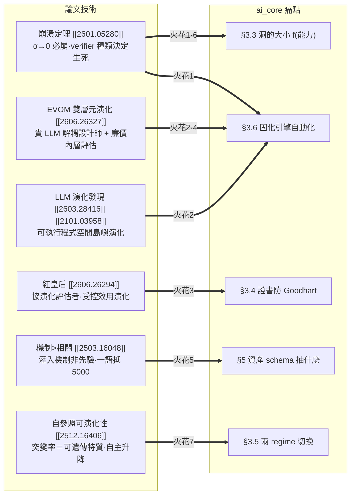
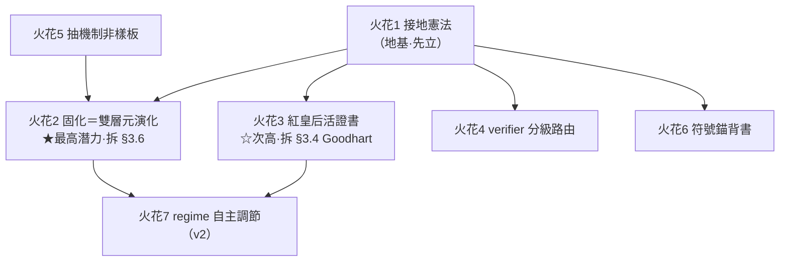

# 論文碰撞・第二輪：自我改進 agent × ai_core 智能分層

> 真相層：`paper_reading/summarize/` 各篇摘要與 `deep/self_improving_program_synthesis.md`。本文只做「論文技術 → ai_core 具體設計決定」的碰撞，引用一律以 [[arxiv_id]] 指回。
> ai_core 北極星見 `roadmap.md`。本文不改 index / session_log。

## 0. 一頁地圖

ai_core 的北極星有三塊最硬的東西尚未釘死（roadmap §3.6 / §3.4 / §8）：**固化引擎要不要自動化、證書怎麼防 Goodhart、兩 regime 何時切換**。這批「自我改進 agent」論文恰好各自啃過其中一塊。下圖把論文技術對準 ai_core 的痛點：

三條主軸（對應任務要求）：
- **(a) 接地訊號必要性** → 火花 1（飛輪硬約束）、火花 4（成本梯度分級）、火花 6（受約束生成的理論背書）。
- **(b) 貴智能改進便宜智能的分層迴圈** → 火花 2（固化引擎＝雙層元演化）、火花 5（資產抽機制非樣板）。
- **(c) 協同演化評估者把關品質** → 火花 3（紅皇后證書）、火花 7（regime 自主調節）。

---

## 火花 1：崩潰定理 → ai_core 飛輪的「接地憲法」

| 欄位 | 內容 |
|---|---|
| **來源技術** | [[2601.05280]] 崩潰定理：純自指（外部接地 αₜ→0）必然 mode collapse（Thm 2 熵衰減上鞅）+ 隨機漫步漂移（Thm 4 AR(1) 係數→1）+ DPI 保證自指不增互資訊（Cor 3）；只要 αₜ≥α*>0 就收斂真分布（Thm 5）。**verifier 種類決定生死**：完美可執行環境免疫、learned verifier（RLHF reward model）會崩、static proxy 被 Goodhart。 |
| **ai_core 問題** | roadmap §3.6 最硬未決——固化引擎「自動」版＝聰明模型掃 log 自動提案新分支。但若飛輪變成「便宜模型生資產 → 便宜模型消費 → 產出又回灌生資產」，這正是 αₜ→0 的自指迴圈，理論上**必崩**。ai_core 至今沒有一條成文規定保證飛輪不掉進這個陷阱。 |
| **具體做法** | 立一條**接地憲法**寫進 §3.4：①任何進 archive 的固化提案，都必須掛在一個**形式可執行 verifier**（ATP v0 已有的 `ast.parse` 過 + 目標節點存在 + 簽名符合 + 單元測試）才允許上線——這就是 ai_core 的 αₜ 來源，且是「免疫」那一檔。②**禁止**用「LLM-as-judge 對 LLM 產出打分」當某環節的**唯一**閘門（那是 learned verifier，會崩）。③把證書欄位升級：每張證書強制標 `grounding_class ∈ {formal_executable, learned, static_proxy}`，讓「這個留白靠什麼接地」變成可稽核的一級欄位，而非藏在穩定度 % 裡。 |
| **效益 / 風險** | 效益：給 ai_core 最偏執的設計信仰（凡事先確定性驗證）一個**動力系統層級的證明**，不再只是工程直覺；且 §6.1 ATP 的確定性驗證一夕之間從「實作細節」升格為「飛輪能否持續的命門」。風險：**意圖翻譯層天生沒有單元測試**——人類意圖無法形式驗證，這塊永遠是 learned/proxy 接地，憲法要明寫「此處豁免但須人類在迴路 + 證書降級標註」，否則會卡死。 |
| **roadmap 落點** | §3.4 證書欄位（加 `grounding_class`）、§3.5 飛輪、§3.6 固化引擎、§6.1 ATP certificate。**這是全篇的地基，其餘火花都站在它上面。** |

---

## 火花 2：EVOM 雙層元演化 + LLM 島嶼演化 → 把「固化引擎」做成可執行的搜尋演算法

| 欄位 | 內容 |
|---|---|
| **來源技術** | [[2606.26327]] EVOM 雙層最佳化：**外層一個純「設計師」LLM（與執行/環境完全解耦）**對 elite 種群做 mutation/crossover 提案「可執行架構程式」，**內層用低保真評估**給便宜 fitness，編譯失敗/崩潰罰 −1000 守衛。[[2603.28416]]：把 LLM 當變異算子，直接在**可執行更新規則程式碼空間**做島嶼種群演化，每候選用回放/訓練 run 端到端評估。[[2101.03958]] 證實「在程式/計算圖空間演化出可執行邏輯」可行。 |
| **ai_core 問題** | roadmap §3.6「**固化不是免費的：誰做？**」——手動固化＝「好用的工具」，自動固化＝「會自我改進的系統」，後者難非常多且 §8 列為「此題優先」。目前只有「聰明模型定期掃 log 自動提案新分支」這句願景，沒有可開工的機制。 |
| **具體做法** | 把固化形式化成 **EVOM 式雙層搜尋**，天然對齊 ai_core「資產工廠 vs 消費者」（§2）： • **外層＝貴智能（稀有、一次性）**：聰明模型當「matcher/程序設計師」，**與消費執行解耦**（照搬 EVOM 把 LLM 定位成可重用設計算子而非執行者）。它讀 `trace[]` NDJSON log，找出「老是掉進同一個 LLM 洞」的輸入群，提案新的確定性 matcher 程式（對現有 matcher 做 mutation / crossover）。 • **內層＝便宜的確定性回放評估（高頻）**：拿歷史 trace 當**保留真值集**——新 matcher 必須在這批 trace 上**重現 LLM 過去被認證為正確的輸出**才存活；誤判 / 編譯失敗 / 簽名不符直接罰負分（EVOM −1000 守衛 = ATP 三層 fail-closed 護欄）。 • **島嶼化（[[2603.28416]]）**：不同框架 / 不同任務類各跑一座島，避免單一壓力早熟。 • **代＝稀疏離線批次**：[[2603.28416]] 每代 30 小時極貴 → ai_core 把「一代」拉到「每累積 N 筆新 trace 才離線跑一次」，貴智能呼叫次數壓到最低（呼應 roadmap §0「飛輪第一圈趁早轉、但要省」）。 |
| **效益 / 風險** | 效益：§3.6 那道「手動 vs 自動」的牆，第一次有了**可開工的具體配方**；且成本結構天生分層（貴外層稀疏跑、廉內層高頻驗），完美吻合 roadmap §2 成本梯度。風險：演化搜尋本身可能昂貴 + 多樣性流失（deep doc §4.2 共通瓶頸）——須靠島嶼 + 稀疏代次 + 嚴格 −1000 守衛壓住；且 v0 不必上，先在 §8「v0 要不要含固化」中當作**v1 的明確路線圖**。 |
| **roadmap 落點** | §2 工廠/消費者、§3.6 固化引擎自動化、§7「組合軸推導 A4」（matcher 被組成調用鏈時的 metadata）、§8 第一題。**本火花最有潛力——它直接拆 §3.6 那個被標為「優先」的最硬未決問題。** |

---

## 火花 3：紅皇后受控效用演化 → 證書的活把關 + 防 Goodhart

| 欄位 | 內容 |
|---|---|
| **來源技術** | [[2606.26294]] RQGM：把**評估者本身拉進自我改進迴圈**。受控效用演化＝搜尋切成 epoch，**世代內凍結一個評估者**（固定準則 → 既有自我改進保證直接適用），只在世代邊界用「在保留真值集上**統計顯著勝出**」的挑戰者評估者替換它，並**選擇性抹除**只丟棄依賴舊評估者的紀錄。反直覺收益：**便宜的學習型 code-review 訊號（查一次 vs 多輪執行）反而提升搜尋效率、省 1.35–1.72× token**；**對抗目標可去除 LLM-judge 偏誤**。 |
| **ai_core 問題** | roadmap §3.4 證書寫「經測試組 B、模型 Z、穩定度 X%」——但**測試組 B 是靜態 proxy**。roadmap §3.5 自己警告 DGM 用 benchmark 跑分當訊號會被 Goodhart 化（火花 1 的 static_proxy 那檔）。固化飛輪跑久了，舊測試組會飽和、被 reward hack、證書變成自我恭維的死數字。 |
| **具體做法** | 把 ai_core 的**測試組也納入演化**（紅皇后）： • 每張證書綁一個「評估者程序」，**世代內凍結**——保住 roadmap「憑證准入」原本要的單調保證（火花 1 的接地不被搖動）。 • **世代邊界**讓一個「在保留真值集上統計顯著更嚴」的挑戰者評估者替換現任；替換後**選擇性抹除**依賴舊評估者的證書 → 那些 LLM 留白被迫**重認證**（接上 §8「撤照流程」）。 • 直接搬 RQGM 兩個反直覺收益：①固化內層（火花 2）加一個**便宜的學習型 code-review 訊號**（查一次）就能提升搜尋效率、省 token——正中 ai_core「省錢省算」初心；②用**對抗樣本目標**去偏——專門蒐集「被舊評估者放行、卻其實爛」的笨模型產出，下世代當對抗集回放，逼出更嚴的評估者，防止飛輪自我寬鬆。 |
| **效益 / 風險** | 效益：證書從「靜態快照」變成「對得起當前最強挑戰者的**活憑證**」，這是 roadmap §3.5「飛輪＝從寬鬆遷往嚴格的力」最缺的那塊引擎；且把 §3.4 對 DGM Goodhart 風險的警告，變成有解的工程機制。風險：RQGM 自承**收斂保證鬆動**（只保「每世代內」）、每次替換**效用掉一段再重爬**——ai_core 要接受「重認證成本」，並把世代切得夠粗以免抖動。 |
| **roadmap 落點** | §3.4 證書、§3.5 兩 regime 遷移、§8「證書放哪、誰簽發、撤照流程」。**次高潛力——它把 §3.4 那個「證書會被 Goodhart」的隱憂變成可落地的活機制。** |

---

## 火花 4：EVOM 低保真內層 + verifier 分級 → per-request 成本梯度的可操作門檻

| 欄位 | 內容 |
|---|---|
| **來源技術** | [[2606.26327]] EVOM「**低保真內層快篩 + 全預算只給定論候選**」的兩段保真度結構；[[2601.05280]] 的 verifier 分級（formal_executable / learned / static_proxy 三檔，可信度遞減）。 |
| **ai_core 問題** | roadmap §2 per-request 成本梯度「先笨模型填，沒過驗證再升級聰明模型」、§3.3「洞的大小 = f(模型能力)」——但**升級門檻怎麼定？洞的大小怎麼動態算？** 目前只有定性描述。 |
| **具體做法** | 把「笨模型先試 → 驗證 → 升級」做成 EVOM 式**保真度階梯**，門檻由**接地訊號強度**決定，而非拍腦袋： • **第一關（低保真、高頻、便宜）**：便宜模型填 + 純確定性驗證。若該請求**掛得上 formal_executable verifier** 且通過 → **直接收笨模型結果**（αₜ 高、可信，多數 case 在此了結）。 • **升級關（高保真、稀有、貴）**：只有當①確定性驗證沒過，或②該請求**只掛得上 learned/proxy verifier**（接地弱）時，才升級貴模型或要人類確認。 • **重述 §3.3**：把「洞的大小 = f(模型能力)」精緻化成 **「洞的大小 = f(該請求能掛上多強的 verifier)」**——能掛強 verifier 的環節，敢給笨模型大洞（驗得住）；只能掛弱 verifier 的環節，洞必須收小或交給貴模型。 |
| **效益 / 風險** | 效益：把 §2/§3.3 從定性願景變成**可實作的路由規則**，且與火花 1 的 `grounding_class` 欄位天然複用（路由器讀證書的接地檔次就知道該不該收）。風險：須為每類任務**預先標定 verifier 強度**，這份標定本身要維護成本（但比逐請求燒貴模型便宜得多）。 |
| **roadmap 落點** | §2 per-request 成本梯度、§3.3 洞的大小、§6.1 ATP `status` 欄位（`uncertified/syntax_ok/rejected` 可擴成保真度檔次）。 |

---

## 火花 5：機制 > 相關 → 資產 schema 抽「機制原語」而非「樣板堆量」

| 欄位 | 內容 |
|---|---|
| **來源技術** | [[2503.16048]]：meta-learning 真正灌進模型的是**可重用的神經機制**（如 LSTM 的計數器電路）而非貝氏簡約先驗；且「**單一夠複雜的語言抵 5000 種**」——機制覆蓋比資料堆量更本質。deep doc §4.3 方向 5 由此導出「以**機制覆蓋率**而非資料量設計改進課程」。 |
| **ai_core 問題** | roadmap §5 上層「讀框架原始碼 → 生資產（結構化抽取）」——資產 schema 該抽什麼？目前清單是 API 簽名 / 用法 snippet / few-shot / 護欄，偏「**樣板堆量**」：每個 API 用法存一條死樣板。這違背 KISS / least dependency，且樣板折舊快（框架一改就過時）。 |
| **具體做法** | 資產抽取改以「**機制覆蓋率**」為目標： • 聰明模型讀框架時，不窮舉每個 API 的 snippet，而是抽出「**能組合出多數用法的少數核心機制 / 原語**」（呼應「一語抵 5000」）——例如框架的「資源生命週期模式」「錯誤傳播慣例」「擴充點協定」這類**可組合的生成機制**，而非 500 條呼叫範例。 • 資產庫結構＝「**機制原語 + 組合規則**」，讓便宜模型靠**組合**覆蓋長尾，而非 retrieve 一條條死樣板。 • 這直接餵 §7 待決的 **Gap C「語意 / 用途描述欄位」**：資產的描述欄位記的是「這條原語是什麼機制、能和誰組合」，而非「這是哪個 API 的樣板」。 |
| **效益 / 風險** | 效益：資產**折舊更慢**（機制比樣板耐久 → roadmap §2「折舊很慢的資產」的具體實現）、資產庫**更小**（符合 KISS）、且更新規則自我改進的訓練/抽取管線從「堆量」轉「覆蓋機制」更省。風險：抽「機制」比抽「樣板」**需要更強的聰明模型、schema 更難驗證**（樣板能 ast 驗、機制較抽象）——這把壓力推回貴智能窗口，但正好是 roadmap §2「趁聰明模型便宜時一次性投資」該花的地方。 |
| **roadmap 落點** | §5 上層結構化抽取、§7 Gap C / B1「語意・用途描述欄位」。 |

---

## 火花 6：符號錨把連續漂移離散化 → 受約束生成 / 行數助手的理論背書

| 欄位 | 內容 |
|---|---|
| **來源技術** | [[2601.05280]] §3.3 開的藥方——**符號錨**：程式**不能微量漂移**，要改就得跳到「下一個有效程式」，形成**位能障壁**，把 Thm 4 的連續隨機漫步**離散化**、擋住漂移；收縮力層級「統計更新 < 符號投影 < 因果更新」。 |
| **ai_core 問題** | roadmap §5 下層「受約束生成」+ 行數助手——**為什麼要把笨模型輸出收縮到窄面**（exact string match、插入第 N 行、固定 snippet）？目前理由是「自由度小 → 不易錯」，純經驗直覺，缺底層說法。 |
| **具體做法** | 用符號錨理論**重新表述**這個核心設計（不是新增機制，是給既有決定一個更硬的「為什麼」，從而指導邊界）： • 行數助手 + 固定 snippet + `ast.parse` 守衛 ＝ 把笨模型生成從「**連續自由文字**（會漂移、會 mode collapse）」強制**離散化**到「**有效程式空間的離散跳躍**」。每次生成必須落在「ast 能 parse、簽名符合、錨點存在」的離散有效點，否則 retry——這正是符號錨的**位能障壁**。 • 把 §6.1 ATP 的**三層安全護欄 fail-closed** 解讀成「**符號投影算子**」（把漂移投影回最近的有效程式）。 • 推論一條設計準則：**洞越小、錨越密 → 漂移越被擋死**（呼應火花 4：弱 verifier 環節就該把洞收小、錨加密）。 |
| **效益 / 風險** | 效益：給 ai_core **最核心的設計選擇**（受約束生成）一個動力系統 / 資訊論層級的背書，從「工程直覺」升級成「有理論的必然」；也解釋了為什麼 Claude Code 的 Edit 要 exact-match（roadmap §5 已有此佐證，本火花補上理論）。風險：純理論映射，**別過度宣稱**——ai_core 不是真在跑 KL 更新，只是借其結構直覺；文件須註明這是「類比指導」而非「形式等價」。 |
| **roadmap 落點** | §5 下層受約束生成、§6.1 ATP skeletonize / 三層護欄。 |

---

## 火花 7：自參照可演化性 + node-specific 突變率 → 兩 regime 的自主調節

| 欄位 | 內容 |
|---|---|
| **來源技術** | [[2512.16406]] 自參照 GHN：**突變率＝可被選擇的可遺傳特質**（node-specific，取 M 個 sigmoid 的 max），**全自主升降無外部排程**——環境切換 → 升變異探索、找到高適應度 niche → 降變異集中；「固定隨機基底當輸出層」化解自參照循環悖論。反直覺：在**非靜止任務**上恢復能力完勝 CMA-ES / OpenES / GESMR / SAMR。 |
| **ai_core 問題** | roadmap §3.5 兩 regime（**開機期寬鬆**讓 LLM 多做 / **成熟期嚴格**拒絕為預設）——**誰決定何時、哪個環節從寬鬆轉嚴格？** 目前是人手動盯，且全系統一刀切，不符「不同環節成熟度不同」的現實。 |
| **具體做法** | 把「**某環節的 LLM 留白佔比**」類比成突變率，做成**自主調節的 node-specific 特質**： • 當某環節的確定性 matcher **老是失效**（新意圖湧現、框架變動、trace 顯示掉洞率上升）→ 自動**「升變異」**：放寬該環節讓 LLM 多做（退回開機期姿態）。 • 當某環節**穩定命中、證書穩定度高**（火花 3 的活證書提供訊號）→ 自動**「降變異」**：收緊、把洞固化掉（進入成熟期姿態，觸發火花 2 的固化）。 • **node-specific**：每個 LLM 留白各自處在不同 regime，不一刀切——正對應 2512.16406 的 per-node 突變率。 • 永遠留一點小噪聲（即使收緊也保留「重新打開」的可能）——對應論文「突變率全 0 仍有微變異」，防止某環節被永久焊死、其實世界已變。 |
| **效益 / 風險** | 效益：roadmap §3.5「飛輪＝從寬鬆遷往嚴格的力」變成**自驅動**而非人盯；且 2512.16406 在非靜止任務上的恢復力，正對應「框架會變、意圖會變」的真實 ai_core 環境。風險：論文自承**計算昂貴**、且可能**早熟收斂**（過早收緊一個其實還在變的環節）——須靠「永遠留小噪聲」+ 火花 3 的對抗去偏來抵抗，且這是 v2 級的精緻化，**v0/v1 先人工切 regime 即可**。 |
| **roadmap 落點** | §3.5 兩 regime、§3.6 固化觸發、§8 A/B 兩層開發節奏。 |

---

## 8. 收束：潛力排序與下一步

**潛力排序**

| 名次 | 火花 | 為何 | roadmap 成熟度 |
|---|---|---|---|
| ★ **最有潛力** | **火花 2（固化＝EVOM 雙層元演化 + LLM 島嶼演化）** | 直接拆 roadmap §3.6 那個被自己標為「**此題優先**」的最硬未決問題，且 EVOM 的成本結構（貴外層稀疏 / 廉內層高頻）**天生長在 ai_core 的工廠/消費者分層上**，幾乎是量身定做。 | v1 路線（v0 後） |
| ☆ 次高 | 火花 3（紅皇后活證書） | 把 §3.4「證書會被 Goodhart」的隱憂，變成有對抗去偏 + 選擇性抹除的**可落地活機制**；兩個反直覺收益（便宜評估者省 token、對抗去偏）正中省錢初心。 | v1 |
| 地基 | 火花 1（接地憲法） | 不是錦上添花，是**前提**——沒有它，火花 2/3 的飛輪理論上會崩。應**最先寫進 §3.4**，其餘火花都引用它的 `grounding_class`。 | 立刻可入規範 |
| 可即用 | 火花 4（verifier 分級路由）、火花 6（符號錨背書） | 都不需新機制，是把既有設計（§2 成本梯度、§5 受約束生成）**接上理論並精緻化門檻**，v0 就能採納其準則。 | v0 可採準則 |
| 中期 | 火花 5（抽機制非樣板） | 改的是 §5 資產 schema 的**哲學**，影響深遠但需更強聰明模型驗證，配合 Gap C 一起定。 | v0/v1 schema 設計 |
| 遠期 | 火花 7（regime 自主調節） | 最優雅但最貴、有早熟風險；v0/v1 人工切 regime 即可，留作 v2。 | v2 |

**一句話總結**：這批論文給 ai_core 補的不是新功能，而是**飛輪的三根承重柱**——火花 1 證明「為什麼非確定性接地不可」（地基）、火花 2 給出「固化引擎怎麼自動跑」（引擎）、火花 3 給出「證書怎麼不腐化」（剎車）。三者合起來，正好把 roadmap §3.5–3.6 那段「飛輪 = 從寬鬆遷往嚴格的力」從願景變成可開工的機制。

> 接續：若要開工，先把**火花 1 的 `grounding_class` 欄位**寫進 `core_nature/axis_spec.md` 的 nondeterministic 軸 / ATP certificate；再用**火花 2** 草擬 v1 的固化引擎切片（離線批次、島嶼、−1000 守衛、trace 回放當保留集）。
