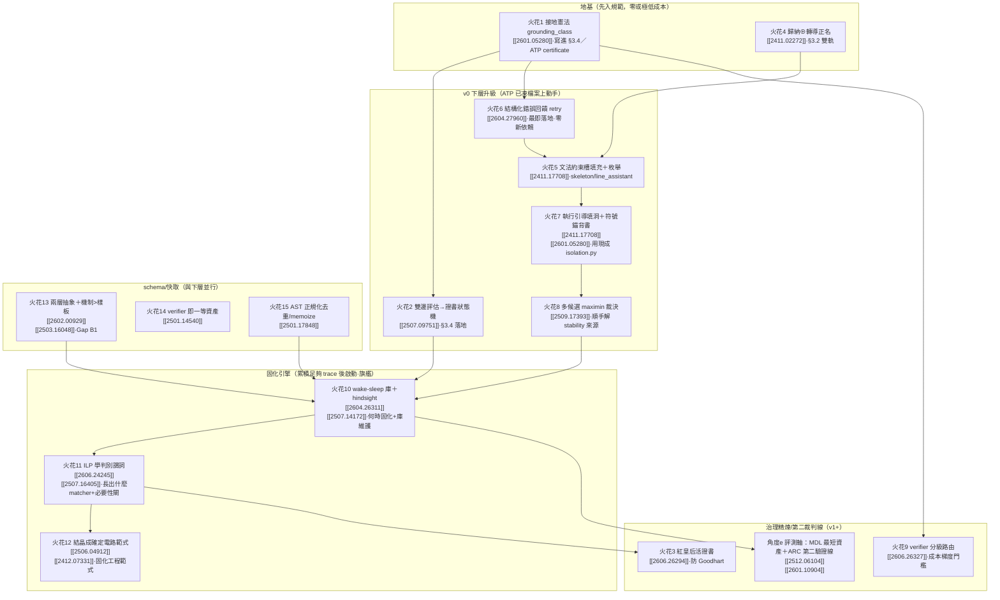

# 論文碰撞・正式彙整版：paper_reading × ai_core

> 這份是把先前四份對撞稿（三份 round2 火花＋一份三方跨融合）**收斂成一份**，並補上兩個尚未被涵蓋的角度——
> **(e) ARC 當裁判／最短程式（Solomonoff/MDL）定位**、**(f) FSM／自動機／可微符號 × 確定性執行層的形式化**。
> 全文圍繞 `roadmap.md` 的一句北極星：**趁貴智能還便宜，讓它生產折舊很慢的符號抽象資產；讓便宜高頻智能去消費；而整圈能不能持續，取決於迴圈裡有沒有一個「不被自己污染的接地訊號」。**

---

## (i) 一句話總結 + ai_core 與論文群最強的 3 條接點

**一句話**：這批論文補的不是 ai_core 的「新功能」，而是把 `roadmap.md` 三塊最硬的未決區（§3.4 證書治理、§3.6 固化引擎、§5 受約束生成）從**工程直覺升級成有定理／有演算法／有評測的可開工機制**——而新補的 (e)(f) 兩角度，正好分別給「**評測軸**」與「**確定性執行層的形式化上界**」釘下地基。

**最強 3 條接點**：

1. **固化引擎（§3.6 / §8「這題優先」的最硬未決題）＝雙旗艦合體**：
   **wake-sleep 庫學習 [[2604.26311]] ⊕ ILP 學判別謂詞 [[2606.24245]]**——前者給「**何時固化、資產庫怎麼維護不爆炸（<100＋LRU）**」，後者給「**固化具體長出什麼 matcher＋『必要性』閘怎麼判**」。資料源（ATP `trace[]` NDJSON）**已存在**，兩者皆屬離線、貴智能、低頻的「資產工廠」工序，產物是純標準庫的確定性 matcher，不污染笨模型消費端。這是把「飛輪」從比喻變成管線的最短路徑。

2. **接地憲法（§3.4 的地基）＝崩潰定理 [[2601.05280]]**：自我改進的數學證明指出「外部接地比例 αₜ→0 必崩」，且**verifier 種類決定生死**（形式可執行＝免疫、learned＝會崩、static proxy＝被 Goodhart）。這把 ai_core 最偏執的信仰（凡事先 `ast.parse`／單元測試確定性驗證）從工程直覺升格成**動力系統層級的命門**；落地物＝每張證書強制標一級欄位 `grounding_class ∈ {formal_executable, learned, static_proxy}`。**其餘所有火花都站在這條憲法上。**

3. **「必要性閘」拿到形式上界（§3.4 的舉證責任）＝matcher＝自動機 [[2505.11694]] [[2509.22284]]**（角度 f 的核心增益）：N-FSM 構造性證明「**前饋網路精確等價於 DFA，且嚴格弱於下推自動機/圖靈機**」、PD-SSM 證明「**單層即可精確模擬任意 N 狀態 FSA**」。對映過來——**凡屬正則／有限狀態／狀態追蹤類的請求，本來就該固化成確定性自動機 matcher，根本輪不到 LLM**；LLM 的「必要性」只在「需無界記憶／非正則／真模糊」處才成立。這給 §3.4「拒絕為預設」一條**可計算的能力邊界**，而非靠拍腦袋。

---

## (ii) 依 roadmap 模組組織的火花總表（精選去重，15 個）

> 涵蓋六角度：**(a)** 受約束生成、**(b)** 程式合成/歸納、**(c)** 自我改進、**(d)** 三方融合/Solomonoff、**(e)** ARC/MDL 評測、**(f)** FSM/自動機/確定性執行。
> 每列：來源 [[arxiv_id]] → 對應問題 → 具體做法 → 效益/風險 → roadmap 落點。原四稿重複的火花（固化、證書、成本梯度、受約束生成）已合併取最強表述。

### A. §3.4 治理地基：拒絕為預設 + 憑證准入（證書 / 第九軸）

| # | 來源 [[id]] | 對應問題 | 具體做法 | 效益 / 風險 | roadmap 落點 |
|---|---|---|---|---|---|
| 1 | 崩潰定理 [[2601.05280]]（c,d,e） | 飛輪若變「便宜模型生資產→便宜模型消費→回灌」即 αₜ→0 自指迴圈，理論上**必崩**；至今無成文防線 | 立**接地憲法**：①任何進 archive 的固化提案必須掛一個**形式可執行 verifier**（ATP 已有 `ast.parse`＋目標節點＋簽名＋單測）才上線＝ai_core 的 αₜ 來源且屬「免疫」檔；②**禁止**用 LLM-as-judge 當某環節唯一閘門（learned verifier 會崩）；③證書強制標 `grounding_class ∈ {formal_executable, learned, static_proxy}` | 效益：把最偏執信仰升級成動力系統級證明，§6.1 確定性驗證從「實作細節」升格為「飛輪命門」。風險：意圖翻譯層天生無單測→須明寫「此處豁免但人類在迴路＋證書降級」 | §3.4 證書欄位、§3.5 飛輪、§6.1 ATP `certificate` |
| 2 | 雙邊事實性評估 [[2507.09751]]（a） | 證書 `status` 目前單邊（過 ast→ok，否則 reject），無法表達「真不確定」 | 對片段同時問「能**確認**正確？」（ast＋簽名＋目標存在）與「能**找到反例**？」（isolation 跑最小測試），映四象限：⟨確認✓,無反例⟩→`syntax_ok`；⟨✗,有反例⟩→`rejected`；**⟨✗,無反例⟩→保 `uncertified`＋`nondeterministic:true`**（誠實標模糊前沿）。仿 ζ_c 用 `memoize` 對 `sha256(片段+測試)` 快取保可稽核 | 效益：把「拒絕為預設＋憑證准入」從口號變**可計算狀態機**，天然分出「真模糊（留 LLM）vs 能力不足（該 retry/升級）」。風險：反例測試需可跑隔離，v0 先只對無副作用片段開 | §3.4、ATP `certificate`/`validity`、第九軸 |
| 3 | 紅皇后受控效用演化 [[2606.26294]]（c） | §3.4 證書綁的測試組 B 是**靜態 proxy**，飛輪跑久會飽和、被 reward hack（§3.5 自承 DGM 風險） | 把測試組也納演化：**世代內凍結評估者**（保住憑證准入的單調保證），**世代邊界**用「在保留真值集統計顯著更嚴」的挑戰者替換，**選擇性抹除**依賴舊評估者的證書→被迫重認證（接 §8 撤照流程）。借兩個反直覺收益：便宜 code-review 訊號省 1.35–1.72× token、對抗樣本去 LLM-judge 偏誤 | 效益：證書從「靜態快照」變「對得起當前最強挑戰者的活憑證」，把 §3.5「從寬鬆遷往嚴格」最缺的引擎補上。風險：收斂保證鬆動（僅保每世代內）、替換要付重認證成本，世代須切夠粗 | §3.4、§3.5、§8 撤照 |

### B. §3.2 / §5 下層：受約束生成（笨模型的窄面填碼）

| # | 來源 [[id]] | 對應問題 | 具體做法 | 效益 / 風險 | roadmap 落點 |
|---|---|---|---|---|---|
| 4 | BARC 歸納⊕轉導 [[2411.02272]]（a,b,d） | §3.2「前濾網命中走純程式碼／落穿掉進 LLM」其實就是歸納⊕轉導二分，但沒被當「可集成的互補對」設計 | 把填洞拆雙軌按 BARC 配方集成：**歸納軌（可驗證、優先）**＝確定性 matcher/snippet 庫嘗試，命中即零 LLM 成本；**轉導軌（兜底）**＝落穿才叫笨模型直接生。關鍵差異：歸納軌命中可被 `ast.parse`＋簽名確定性驗證，BARC「知道何時成功」這賣點在 ai_core 是現成的 | 效益：給 §3.2 的「洞」一個有理論背書的填法，歸納軌天然省錢。風險：BARC 互補性在 ARC 知覺任務測得，程式碼編輯場景比例未知→用 ATP `tier×method` pivot 實測，別假設照搬 | §3.2（正名歸納/轉導雙軌）、§5 下層 |
| 5 | GridCoder 文法約束槽填充＋機率枚舉 [[2411.17708]]（a,b） | §5 下層仍是「笨模型一次自由生」，自由度靠提示語氣收斂，非真收斂 | `skeletonize()` 保留的錨點鄰域 AST→導出**小型文法/合法選擇集**（合法型別、已抽取 API 名、snippet 變體）；笨模型不自由生碼，而在合法集上輸出機率分佈；ai_core 做**機率排序枚舉**top-k，逐一 `ast.parse`＋簽名＋isolation 驗，第一個過即採用。GridCoder 證明條件獨立攤平只需極少推論＝便宜（79.3%>不拆 75.9%） | 效益：把「自由度爆炸→必錯」真正收斂成「在有限合法集上選」。風險：合法集不全→漏接正解；保留 `pruning.strategy=raw` 自由生退路當對照 | §5、`line_assistant.py`/`skeleton.py` |
| 6 | LLM+ASP 結構化錯誤回饋 [[2604.27960]] / ChatLogic [[2407.10162]]（a） | v0 retry 只有「ast 過/不過」二元判斷，重試 prompt 不變＝盲目重抽 | 把確定性驗證器的**結構化錯誤**（SyntaxError 行列、簽名 expected/got、guardrail 命中）格式化成 `feedback` 疊進下輪 context binding，要小模型「只改錯的地方」；給的不是完整 API 文件而是**裁剪過的精簡參考**（接火花 11/14 的資產庫）；每輪 `{attempt,reason,fixed?}` 追加 ATP `trace[]` | 效益：[[2604.27960]] 實證弱模型 2–3 輪收斂，直證「便宜小模型也能可靠」；幾乎零新依賴（錯誤本來就有，只是沒回灌）。**最即可落地**。風險：過擬合錯誤訊息局部修補→用 `ast` 全檔重驗擋住 | §6.1 `demos/v0_pipeline.py` retry 環 |
| 7 | GridCoder 執行引導 LTS [[2411.17708]] / 符號錨理論 [[2601.05280]] §3.3（c,d） | §5「自由度小→不易錯」「行數助手精準標位」缺底層說法；笨模型一次盲生，沒用上 ATP 已凍的 `isolation.py` | ①**理論背書**：行數助手＋固定 snippet＋ast 守衛＝把生成從「連續自由文字（會漂移/mode collapse）」**離散化**到「有效程式空間的離散跳躍」（符號錨位能障壁）；三層護欄 fail-closed＝符號投影算子；推論「洞越小、錨越密→漂移越被擋死」。②**執行引導**：別一次盲生，改逐步——填一段→`isolation.py` 跑→中間報錯/缺符號回餵再續填（GridCoder proxy 結構泛化 10%→80%） | 效益：給最核心設計選擇一個資訊論級背書；用現成 `isolation.py` 把「結構泛化＝靠執行引導」變現，可能是 §6 對照組翻盤的關鍵。風險：逐步回饋增加呼叫數（與省錢張力）→配火花 8 maximin、火花 13 memoize 控成本；須註明是「類比指導」非「形式等價」 | §5、`line_assistant.py`+`isolation.py`、§6.1 三層護欄 |

### C. §2 / §3.3 成本梯度：per-request 升級與裁決

| # | 來源 [[id]] | 對應問題 | 具體做法 | 效益 / 風險 | roadmap 落點 |
|---|---|---|---|---|---|
| 8 | SYNTRA 偽標籤篩假設＋greedy maximin [[2509.17393]]（a,b） | §3.3「先笨想、沒過再升級聰明」缺裁決機制；§2 成本梯度缺「用多貴、問幾次」準則；第九軸 `stability` 沒量測來源 | 笨模型生 N 個候選 patch→全過確定性閘得「假設類」；**貴智能只當偽標籤器**（只在候選分歧的精選輸入上呼叫，淘汰不一致候選，不做生成）；**greedy maximin** 選「最能拉開候選的測試輸入」把貴智能呼叫腰斬；副產品＝候選**存活率**天然就是 `certificate.stability` 的量測來源 | 效益：把「笨想→貴裁決」從口號變主動學習迴圈，順手解 `stability` 沒來源。風險：偽標籤受貴智能上限影響（會誤淘汰正解）；N 太小則假設類貧乏 | §3.3/§2、第九軸 `stability`、`sfc.py`↔`llm_call.py` 間 filter |
| 9 | EVOM 低保真內層＋verifier 分級 [[2606.26327]] [[2601.05280]]（c） | §3.3「洞的大小＝f(模型能力)」「升級門檻怎麼定」只有定性描述 | 把「笨試→驗證→升級」做成保真度階梯，門檻由**接地訊號強度**決定：第一關（低保真高頻）便宜模型＋確定性驗證，若請求掛得上 `formal_executable` verifier 且過→直接收；升級關（高保真稀有）僅當驗證沒過或只掛得上 learned/proxy verifier 時才升級貴模型。重述 §3.3 為「**洞的大小＝f(該請求能掛上多強的 verifier)**」 | 效益：把 §2/§3.3 從願景變可實作路由規則，與火花 1 的 `grounding_class` 欄位天然複用。風險：須為每類任務預標 verifier 強度，有維護成本（仍比逐請求燒貴模型便宜） | §2、§3.3、ATP `status` 擴成保真度檔次 |

### D. §3.6 / §8 固化引擎（最硬未決，旗艦合體）

| # | 來源 [[id]] | 對應問題 | 具體做法 | 效益 / 風險 | roadmap 落點 |
|---|---|---|---|---|---|
| 10 | DreamProver wake-sleep [[2604.26311]] ＋ SOAR hindsight [[2507.14172]]（b,c,d）**旗艦** | §3.6/§8「固化誰做、自動還是手動」未決；「資產庫多大、怎麼維護不爆炸」無答案 | wake-sleep 直接映成自動固化：**wake**＝既有飛輪把 `trace[]` 落 NDJSON（成功/失敗都記）；**sleep**（貴智能定期離線跑）＝掃 trace→語意分群找「反覆出現的同類洞」→貴智能抽象成候選 matcher/snippet→重放歷史 trace 驗證→AST 正規化去重→併入庫＋LRU 淘汰維持 <100 條。**hindsight relabel**：笨模型沒解原任務但過 ast＋簽名閘的 patch，對「自己產生的(錨點上下文→這段碼)」就是合法 few-shot asset→失敗 relabel 成資產 | 效益：把最硬的題從「憑空猜」變「照 DreamProver 配方落地」；消融鐵證「緊湊抽象庫(104)>龐大低階庫(53)」給「庫別無限長」硬依據；wake 資料源已存在、sleep 純離線低頻貴智能＝契合 §2。風險：引理庫**領域特定**（每框架各演化一個）；語意分群需嵌入模型→與「零相依」衝突→**嵌入只准在資產工廠側，不滲消費端** | §3.6+§8、資產庫策略(<100+LRU)、`hub.py` |
| 11 | AutoSpec CEGIS×ILP [[2606.24245]] ＋ Poker 自監督 ILP [[2507.16405]]（b）**旗艦** | 火花 10 給庫維護骨架，但沒答「自動固化具體怎麼從 trace 長出一個新 matcher」；§3.4「必要性」缺可操作判定 | 把固化做成 CEGIS×ILP 迴圈：掃 trace 標**偽陽性(FP)**＝「本該純程式碼接住卻誤掉進 LLM」、**偽陰性(FN)**＝「笨模型搞砸、本可被某 matcher 攔下」當正/負例餵 ILP，求「最能乾淨分離兩類的判別謂詞」（**ILP 只提名 matcher 不定案**，提名後重放歷史 trace 驗）。**「必要性」閘＝可被謂詞乾淨分離與否**：能分離→撤照（不該再用 LLM）；找不到→證明確定性辦不到，LLM 留白通過必要性閘。Poker「準確率隨例子單調遞增」對應 `stability` 隨 trace 收斂 | 效益：補火花 10 缺的「固化演算法引擎」，兩旗艦合體覆蓋 §3.6 全題；把「必要性/撤照/可稽核」三口號全變 ILP 可操作步驟；4–5 次收斂、規則可讀。風險：ILP 求解器(ILASP/Popper)是外部相依→限工廠側、產物必須純標準庫；謂詞庫需種子（ATP `SENSITIVE_NAMES` 黑名單可當起點） | §3.6 自動版、§3.4 必要性/撤照、`skeleton.py` 謂詞庫種子 |
| 12 | DiffLogic CA「結晶成確定電路」[[2506.04912]]（f）＋NeSyA 機率語意自動機 [[2412.07331]]（f） | §3.5/§3.6 反覆用「固化＝把模糊地帶凍成確定性程式碼」的隱喻，但缺一個**可借鑑的工程範式**：訓練時可學、推論時確定 | DiffLogic CA 提供範式：**連續鬆弛訓練（可微、可學）→ 推論時每閘取最可能運算、結晶成確定性電路**——正是 ai_core「上層貴智能學/搜尋（可微化的固化過程）→ 下層產確定性 matcher 資產」的硬體級對應（甚至可上 FPGA 奈秒推論）。NeSyA 補上「**符號自動機（自動機管時序、命題邏輯管轉移）＋機率語意＋矩陣/KC 精確推理**」＝帶機率證書的確定性執行層，正好給火花 2 的證書一個「時序/狀態類洞」的精確推理引擎 | 效益：把「固化＝結晶」從比喻變成有實作範式（連續訓練→離散結晶）；NeSyA「機率>模糊」實證支持證書用機率語意而非模糊分數。風險：DiffLogic CA 訓練數值不穩、限簡單圖樣；NeSyA 屬時序域，ai_core 多數洞非時序→只在「狀態追蹤型洞」採用 | §3.6 固化範式、§3.4 證書（機率語意）、確定性執行層 |

### E. §5 上層抽取 / §7 待決規範（schema / memoize / verifier）

| # | 來源 [[id]] | 對應問題 | 具體做法 | 效益 / 風險 | roadmap 落點 |
|---|---|---|---|---|---|
| 13 | TheoryCoder-2 兩層抽象 [[2602.00929]] ＋「機制>樣板」[[2503.16048]]（b,c） | §7 Gap B1（語意/用途欄位）缺；§5 資產清單偏「樣板堆量」（每 API 存一條死樣板，折舊快） | asset schema 照兩層設計：**高層（語意/觸發層）**＝類 PDDL 前提/效果＝「適用什麼錨點上下文、產生什麼編輯」（正是 Gap B1 缺的用途描述、§3.4 證書要綁的適應症）；**低層（grounding）**＝可執行 matcher 謂詞＋snippet 模板。並把抽取目標從「窮舉 snippet」改成「**抽能組合出多數用法的少數核心機制/原語**」（一語抵 5000），讓便宜模型靠組合覆蓋長尾；借「極簡示例控抽象粒度」 | 效益：給 Gap B1 有來歷的 schema 骨架；機制比樣板折舊慢、庫更小（KISS）。風險：抽機制比抽樣板需更強聰明模型、schema 更難驗（壓力推回貴智能窗口，但正是該花的地方） | §7 Gap B1、§5、ATP `asset.origin/payload/target` |
| 14 | VERUS-LM 知識庫範式 [[2501.14540]]（a） | §5 已列「verifier hook」但未展開；下層每次驗證臨時拼 | 上層把框架**不變式抽成可複用的確定性 verifier 資產**（新 `asset.kind:"verifier"`），下層每次填碼沿用同一 verifier 跑火花 2 雙邊評估＝「抽一次、用多次」對齊工廠/消費者時間維度；VERUS 語意精煉→回報**最小衝突子集**（哪幾行違反哪條不變式）餵回火花 6 結構化 retry | 效益：把「驗證」變折舊很慢的資產；最小衝突子集讓 retry 回饋更精準（比「整段錯」好用）。風險：不變式不一定能完全形式化→verifier 只覆蓋可形式化部分，其餘退回火花 2 的「真不確定」 | §5 verifier hook、ATP `asset.kind` |
| 15 | eggp 等式圖語意去重 [[2501.17848]]（b,d） | memoize 若 key 是字面字串，「語意同、字面不同」會 miss、重複燒笨模型；固化引擎抽 asset 會產大量語意等價條目灌爆庫 | ①**memoize key 用 AST 正規化**（變數改名、等價語法歸一）再當 key→提升命中率省錢，純 `ast` 不破壞零相依；②**資產庫去重用等價類**（AST 正規化＋樹編輯距離，服務火花 10 的「<100 緊湊庫」）。只做**保守正規化**（改名/常數摺疊/交換律），別追完備等價判定（會指數爆炸） | 效益：低成本顯著提升 memoize 命中率與資產庫純度，兩處直接省 §2 高頻成本。風險：完整等式飽和爆炸→只做單步保守版 | §7 候選軸 C `memoize.py`、火花 10 去重步、`hub.py` |

### F. 角度 (e) ARC/MDL：評測軸與「最短資產」定位（補強，不另列火花表，融入評測線）

> 角度 (e) 的三篇主要不是「新機制火花」，而是給 ai_core 釘下**評測哲學與第二條驗證線**——故獨立成下節 §評測軸，避免與上表火花重複計數。

---

## (ii-附) 角度 (e) 專節：ARC 當裁判 × 「貴智能產最短/最簡資產」的評測軸

ai_core 北極星說「資產要折舊很慢、要省」，但 `roadmap.md §6` 的 v0 驗收只有「對照組失敗 vs 實驗組成功」一個二元判據，**缺一個量化「資產有多精簡/多接近最短程式」的軸**。角度 (e) 三篇正好補這塊：

| 來源 [[id]] | 給 ai_core 的東西 | 對映 roadmap |
|---|---|---|
| **CompressARC（MDL/壓縮即智能）[[2512.06104]]** | 把「解題」重述為「**找能印出資料集的最短自含程式**」（code-golf/MDL），由奧坎剃刀＝最短程式會正確泛化。對映：ai_core「貴智能產資產」的**品質軸＝資產的描述長度（MDL）**——同一個洞，**能用更短 matcher/snippet 接住的資產更優**。可把「固化提案」的優選準則從「命中率」升級為「**命中率 / 描述長度**」（CompressARC 損失各項類比 VAE KL/重建＝ai_core 的「泛化 vs 擬合」權衡） | §5 資產品質、§3.6 固化提案優選、§6 驗收新增「資產 MDL」軸 |
| **ARC Prize 2025（精煉迴圈）[[2601.10904]]** | 2025 的統一視角「**refinement loop＝以回饋訊號把某程式/某組權重迭代換成略好的版本**」——這**就是 ai_core 飛輪的外部同義詞**（程式空間 vs 權重空間只是換被精煉的對象）。且報告核心警訊「**當前推理被知識覆蓋綁死**」反向印證 ai_core 路線：把能力**固化成確定性程式碼**＝把「推理」與「知識記憶」分離，正是報告說「真正缺的新點子」 | §3.5 飛輪＝refinement loop、§3.4 分離知識/推理的合法性背書 |
| **ARC 當裁判（cross_fusion 提案 5 + 本三篇）** | ARC 是「最友善裁判」（少範例、結構 OOD、程式執行可驗證、完全客觀）。建議**開第二條驗證線**：把 ai_core「行數助手＋受約束生成＋retry/guard」鷹架，**同一套**套到 ARC 的 DSL 填洞任務上（DSL 填洞而非檔案填洞），用 [[2411.02272]] 歸納⊕轉導當對照基線，在客觀裁判下交叉驗證「飛輪是否真在轉」 | §6 第二條驗證線（與 §6.1 程式碼編輯線並行） |

> 關鍵連結：崩潰定理 [[2601.05280]] 在此與 (e) 握手——**「程式執行＝完美 verifier，免疫崩潰」正是 ARC 之所以是好裁判、也是 ai_core `ast.parse` 接地之所以成立的同一條原理**。三方（MDL 最短程式、ARC 客觀裁判、αₜ 接地定理）指向同一個 Solomonoff/AIXI 理想的可跑近似：**智能＝找出能解釋資料的最短程式**，ai_core 是它的「工程治理」切面。

---

## (iii) 建議落地優先序

**一句話排序**：先把**火花 1（接地憲法）＋火花 4（歸納⊕轉導正名）**寫進規範（地基、近零成本）；v0 下層按**火花 6→2→5→7→8**做成完整升級（全落在 ATP 已凍檔案，火花 6 最即落地）；schema 線**火花 13/14/15** 並行；待 `trace[]` 累積足夠，啟動固化雙旗艦**火花 10⊕11**、用火花 12 當工程範式；治理精煉（火花 3/9）與評測軸/ARC 第二線（角度 e）留 v1+。

---

## 附錄：六角度 × 火花對照

| 角度 | 來源稿/論文 | 落在哪些火花 |
|---|---|---|
| (a) 受約束生成 | round2_constrained_codegen | 2,5,6,7,8,14 |
| (b) 程式合成/歸納 | round2_program_synthesis | 4,5,8,10,11,13,15 |
| (c) 自我改進 | round2_self_improving | 1,3,7,9,10,12,13 |
| (d) 三方融合/Solomonoff | cross_fusion | 1,4,7,15＋評測軸 |
| (e) ARC/MDL 評測 **(新)** | 2512.06104,2601.10904,2601.05280 | §評測軸專節（MDL 最短資產、refinement loop＝飛輪、ARC 第二裁判線） |
| (f) FSM/自動機/確定性執行 **(新)** | 2505.11694,2412.07331,2506.04912,2509.22284,2412.14076 | 火花12（結晶範式＋機率語意自動機）＋接點(i)-3（matcher=DFA/FSA 給 §3.4 必要性閘形式上界） |

> **角度 (f) 補充說明**：除火花 12 外，[[2505.11694]] N-FSM 與 [[2509.22284]] PD-SSM 共同給 §3.4「必要性閘」一條形式上界——**正則/有限狀態/狀態追蹤類本就該固化成自動機 matcher，不該放 LLM**（見接點 (i)-3）。[[2412.14076]] sDTM（稀疏可微樹操作）技術上漂亮（位移實現可微 left/right/cons 樹操作、零樣本詞彙泛化），但**需訓練神經網路＋梯度，與 ai_core「純標準庫、零相依」硬衝**，與 LPN/NLI 同列**負面火花**；唯一可借用點＝它把「**樹的結構（索引）／內容（值）分離**」這個表示選擇，可啟發 `skeleton.py` 的 AST 抽取（結構與內容分離地存錨點鄰域），但只取設計直覺、不取可微實作。
