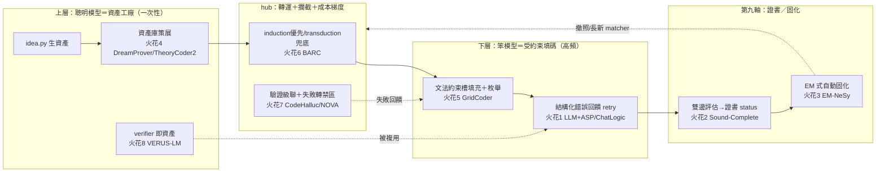

# Paper Collision Round 2 — 神經符號／受約束生成 × ai_core 受約束程式碼生成

> **任務**：把 `pas/paper_reading` 的神經符號（NeSy）／受約束解碼／程式合成論文，與 ai_core 的北極星（`roadmap.md`：貴稀有智能＝資產工廠 vs 便宜高頻智能＝資產消費者；第一目標＝程式碼助手＝上層結構化抽取＋下層受約束生成）對撞，產出可落地的火花。
> **產出**：8 個火花。每個＝[來源論文／技術] → [ai_core 對應問題／模組] → [具體做法] → [預期效益／風險] → [roadmap 落點]。
> **引用慣例**：論文以 [[arxiv_id]] 標註；ai_core 內部以 `roadmap.md §x` / `DECISIONS.md` / ATP v0 schema 欄位標註。
> 建立於 2026-06-27，第二輪對撞（聚焦受約束程式碼生成與抽取）。

---

## 0. 一頁地圖：論文機制掛到哪個 ai_core 環節

ai_core v0 切片（`roadmap.md §6.1`，ATP v0）是一條 `idea.py`（工廠）→ `hub`（轉運＋攔截）→ `sfc.py`（消費）的 asset 流水線。下面把 8 個火花掛到對應環節：

---

## 火花 1 — 把「盲目 retry」升級成「結構化錯誤回饋 retry 環」

| 欄位 | 內容 |
|---|---|
| **來源** | LLM 當 ASP 程式設計師 [[2604.27960]]（求解器結構化錯誤驅動自我修正，平均 2.18 次迭代收斂）＋ ChatLogic [[2407.10162]]（語法修正吃執行錯誤訊息＋語意修正用反向翻譯，+13.9% 執行率） |
| **對應模組** | `roadmap.md §6.1` 的 `sfc.py` consume 階段 + `demos/v0_pipeline.py` 的 retry 環；ATP `trace[].reason`、`certificate.status` |

**具體做法（可落地步驟）**
1. v0 現況的 retry 只有「`ast.parse` 過／不過」的二元判斷，重試時 prompt 不變＝盲目重抽。改為：把確定性驗證器吐出的**結構化錯誤**（`SyntaxError` 的行列＋訊息、簽名不符的 expected/got、guardrail 命中的 `SENSITIVE_NAMES`）格式化成一段 `feedback` 字串。
2. 下一輪 `llm_call` 的 context binding（元件 2 `lib/llm_call.py`）疊上這段 feedback，並把上一輪的錯誤輸出一併貼回，要小模型「只改錯的地方」。
3. 仿 [[2604.27960]] 的「context rot」發現：給笨模型的不是完整 API 文件，而是**裁剪過的精簡參考**（接火花 4／8 的資產庫），錯誤回饋也只貼相關片段。
4. 把每輪的 `{attempt, reason, fixed?}` 追加進 ATP `trace[]`，迭代上限沿用 `lib/interact.py` 的 `max_rounds`。

**預期效益／風險**
- 效益：[[2604.27960]] 顯示結構化錯誤回饋讓弱模型 2~3 輪內收斂，正中 ai_core「用便宜小模型也能可靠」的初心；幾乎零新依賴（錯誤本來就有，只是沒回灌）。
- 風險：回饋可能誘發小模型「為迎合錯誤訊息而過擬合」局部修補卻破壞他處 → 用 `ast` 全檔重驗（已有）擋住；max_rounds 防 actor↔critic 無限互踢。

**roadmap 落點**：v0 切片 `demos/v0_pipeline.py` retry 環的第一個增量；順帶逼出 `DECISIONS.md B1`（精簡參考＝語意欄位）。

---

## 火花 2 — 雙邊事實性評估 → 給第九軸證書一個「真的不確定」的合法狀態

| 欄位 | 內容 |
|---|---|
| **來源** | 健全且完整的 NeSy 推理 [[2507.09751]]（對每原子問兩次「能驗證？能反駁？」映成 Belnap 四值；快取函數 ζ_c 保證一致賦值，矛盾被局部化不爆炸） |
| **對應模組** | 第九軸 `nondeterministic` 證書（`roadmap.md §3.4`）；ATP `certificate.status ∈ {uncertified, syntax_ok, rejected}`；`lib/memoize.py` |

**具體做法**
1. v0 證書 status 是單邊的（過 ast → `syntax_ok`，否則 `rejected`）。引入**雙邊驗證**：對一份生成片段同時問兩件事——「能否**確認**正確？」（`ast.parse` 過＋簽名符＋目標節點存在）與「能否**找到反例**？」（`execute_in_isolation` 跑最小測試）。
2. 映成四象限狀態：⟨確認✓，無反例⟩→`syntax_ok`（可寫檔／可進認證流程）；⟨確認✗，有反例⟩→`rejected`；⟨確認✗，無反例⟩→**保持 `uncertified` 並標 `nondeterministic:true`**——這正是 `roadmap.md §3.1` 那個「永遠不會閉合的模糊前沿」，誠實標記它，而非假裝 rejected 或假裝 ok。
3. 仿 ζ_c 快取：用 `lib/memoize.py` 對 `sha256(片段+測試集)` 快取狀態，保證同一 asset 重評得到同一證書（可稽核性的前提）。

**預期效益／風險**
- 效益：把 `roadmap.md §3.4`「拒絕為預設＋憑證准入」從口號變成**可計算的狀態機**——證書不再是「過/不過」，而是「確認/反駁」兩個獨立確定性測量的合成，天然標出哪些洞是真模糊（該留 LLM）哪些是能力不足（該 retry／升級）。
- 風險：需要 `execute_in_isolation` 能跑出最小反例測試，v0 只有軟隔離（`subprocess env 白名單`）→ 先只對無副作用片段開反例測試，有副作用者退回單邊。

**roadmap 落點**：`roadmap.md §3.4` 治理原則落地；擴充 ATP `certificate` 欄與 `validity` 欄；連動 `DECISIONS.md C`（第九軸）。

---

## 火花 3 — EM 解耦 → 攻「最硬未決題」：固化引擎自動 vs 手動（§3.6）

| 欄位 | 內容 |
|---|---|
| **來源** | EM-NeSy [[2606.14463]]（把 NeSy 重鑄成 EM：E 步用**任意不可微推論引擎**算後驗、M 步只更新神經組件；徹底解耦「約束滿足」與「優化目標」） |
| **對應模組** | `roadmap.md §3.6 / §8` 固化（crystallization）引擎——標「這題優先」的最硬未決題 |

**具體做法**
1. `roadmap.md §3.6` 卡在「固化（把 LLM 老在處理的同類模糊案例凍成確定性 matcher）誰來做」：手動＝工具、自動＝自我改進系統。EM 提供一個**不需要可微、不需要聰明模型每次在線**的自動固化框架：
   - **E 步（確定性、不可微）**：掃 ATP `trace[]` 落盤的 NDJSON，對「同一錨點型態／同一錯誤 reason」的案例做聚類（純 `ast` 結構特徵 + reason 標籤），算出「哪一類案例佔了 LLM 多少呼叫」的後驗分佈——對應 EM 的 E 步用任意引擎算 p(z|y)。
   - **M 步（只更新確定性層）**：對後驗質量最大的那一類，由**聰明模型一次性**提案一個新的確定性 matcher／snippet 模板（`roadmap.md §3.2` 的前濾網分支），加入資產庫。梯度（聰明模型算力）只花在 M 步，E 步全是免費的確定性統計。
2. 收斂條件：當某類案例的「LLM 命中率」被新 matcher 攔截到趨近 0，該類即完成固化（撤照，`roadmap.md §3.5` 飛輪）。

**預期效益／風險**
- 效益：把「自動固化」從「需要一個會自我改進的大系統」降規成「**離線統計（E）＋稀疏的聰明模型提案（M）**」，完全契合 ai_core「聰明模型稀有、一次性」的成本模型；E 步純標準庫（`ast`/`json`），不破壞 `dependencies=[]`。
- 風險：聚類的「同類」判準若太粗 → 固化出過度泛化的 matcher（誤攔本該走 LLM 的案例）；用火花 2 的證書 status 當守門——只固化 `rejected/uncertified` 反覆出現的類，不動已 `syntax_ok` 的。

**roadmap 落點**：直接回答 `roadmap.md §8`「固化引擎手動 vs 自動（這題優先）」；給出一條「v0 先落 E 步離線統計、M 步暫手動」的漸進路徑。

---

## 火花 4 — Wake-Sleep 庫策展 → 上層資產庫的「防膨脹策展器」

| 欄位 | 內容 |
|---|---|
| **來源** | DreamProver [[2604.26311]]（sleep 階段：語意分群→抽象→樹編輯距離去重→驗證→LRU 遺忘，維持 <100 條緊湊庫，證實「緊湊抽象庫勝龐大低階庫」）＋ TheoryCoder-2 [[2602.00929]]（LLM in-context 合成 PDDL 高層運算子＋Python 謂詞低層 grounding，跨 episode 重用成長抽象庫） |
| **對應模組** | `roadmap.md §2/§5` 上層「讀框架→生資產」；元件 4 Function Hub / `thinking_routing.md` Indexer 升級版 |

**具體做法**
1. ai_core 上層會持續生 snippet/few-shot/骨架，但**沒有資產庫管理故事**——膨脹後反而塞爆下層笨模型的 context（與火花 1 的「精簡參考」衝突）。引入一個 `idea curate` 子命令（聰明模型，one-shot，低頻）：
   - 對累積的 asset 依 `ast` 結構相似度分群（DreamProver 的語意分群）；
   - 每群抽象成一個**參數化模板**（TheoryCoder-2 的「高層 PDDL 運算子＋低層 Python 謂詞」二層＝ai_core 的「snippet 骨架＋確定性驗證謂詞」二層）；
   - 用樹編輯距離去重，LRU 遺忘長期沒被 `trace[]` 命中的 asset，維持庫緊湊。
2. 緊湊庫直接餵火花 1 的「精簡參考」與火花 5 的「文法約束」。

**預期效益／風險**
- 效益：[[2604.26311]] 實證緊湊抽象庫解題數遠勝堆疊低階庫（104 vs 53）；對 ai_core 意味著「下層每次填碼吃的 context 更小、更便宜」，直接省 token＝省錢（北極星）。
- 風險：抽象過度→模板太通用反而要笨模型填更多自由度（違背 `roadmap.md §5`「自由度愈小愈不會搞砸」）；用 `trace[]` 命中率回饋控制抽象粒度，沒人用的抽象就 LRU 掉。

**roadmap 落點**：元件 4 Function Hub＋Indexer 升級版（`thinking_routing.md`）；連動 `DECISIONS.md B1`（語意欄位是策展的輸入）。

---

## 火花 5 — 文法約束槽填充＋機率枚舉 → 下層「窄面填碼」的本質升級

| 欄位 | 內容 |
|---|---|
| **來源** | GridCoder [[2411.17708]]（條件獨立假設攤平 DSL token 搜尋空間，只需幾次神經推論＋機率枚舉）＋ NLI [[2604.18907]]（Inductor 學離散 token 程式＋Interpreter 遞迴可微執行，長度外推 OOD 99%） |
| **對應模組** | `roadmap.md §5` 下層受約束生成；v0 `line_assistant.py`（錨點定位）＋`lib/skeleton.py`（`ast` 裁剪鄰域） |

**具體做法**
1. v0 下層目前是「把 snippet 寫進 prompt＋行數助手標位置，讓笨模型一次寫出」——仍是自由文字生成。升級成**文法約束槽填充**：
   - `skeletonize()` 已保留錨點鄰域的 AST → 從中導出一個**小型文法／選擇集**（這個槽合法的型別、可用的已抽取 API 名、snippet 變體），當作 GridCoder 的「DSL token 集」。
   - 笨模型不再自由生碼，而是對每個槽輸出一個**在合法選擇集上的機率分佈**（受約束解碼的弱化版：用 prompt 限定「只能從這張清單選」）。
   - ai_core 做 GridCoder 式的**機率排序枚舉**：依機率展開 top-k 候選，每個用 `ast.parse`＋簽名＋`execute_in_isolation` 確定性驗證，第一個過的即採用。
2. NLI 的啟示：把填碼看成「離散骨架（聰明模型給）＋槽內細節（笨模型給）」的二層，遞迴套用到巢狀結構（函式內的子表達式）。

**預期效益／風險**
- 效益：把「自由度爆炸→必錯」（`roadmap.md §5` 對笨模型的核心擔憂）真正收斂成「在有限合法集上選」，自由度由文法決定而非提示語氣；GridCoder 證明這種枚舉只需極少推論次數＝便宜。
- 風險：合法選擇集若不全 → 正解被排除在外（漏接）；保留一條「raw 自由生成」退路（對應 `pruning.strategy=raw` 對照組），文法只當主路。

**roadmap 落點**：`roadmap.md §6` v0 的 `line_assistant.py`／`skeleton.py` 升級；這是下層受約束生成最直接的演算法骨幹。

---

## 火花 6 — Induction 優先 / Transduction 兜底 → per-request 成本梯度的具體機制

| 欄位 | 內容 |
|---|---|
| **來源** | BARC [[2411.02272]]（分別訓歸納模型〔合成程式＋範例過濾〕與傳導模型〔直接神經預測〕；集成＝歸納優先、無解時傳導兜底，互補強）＋ SYNTRA [[2509.17393]]（LLM 當偽標籤器＋greedy maximin 主動選最具判別力測試，省一半呼叫） |
| **對應模組** | `roadmap.md §2/§3.3`「先笨模型填、沒過驗證再升級聰明模型」的 per-request 成本梯度；ATP `degradation.tier` |

**具體做法**
1. `roadmap.md §3.3` 把成本梯度講成抽象的「動態縮放洞」，BARC 給出可實作的二層集成：
   - **路徑 A（induction，便宜）**：笨模型走火花 5 的文法約束填碼，產出片段→過確定性驗證（範例過濾）。
   - **路徑 B（transduction，貴）**：A 連續失敗 N 次 → 升級聰明模型直接重寫整段（傳導式直接預測）。
   - `degradation.tier` 記錄哪一層成功，寫進 ATP，餵給火花 3 的固化決策（某類案例若 A 永遠失敗，要嘛新 matcher、要嘛永久劃為聰明模型領地）。
2. SYNTRA 的省呼叫技巧：當有多個候選片段難分時，不要逐一全測，用 greedy maximin 選「最能淘汰最多候選」的那個確定性測試先跑，省驗證成本。

**預期效益／風險**
- 效益：把成本梯度做成可量測的 tier 切換，且每次切換都產生「該案例笨模型行不行」的數據——這正是飛輪（`roadmap.md §3.5`）需要的燃料。
- 風險：升級門檻 N 設太低→過早燒聰明模型（貴）；設太高→使用者等太久。用 `trace[]` 統計各案例型態的歷史成功 tier 自適應調 N。

**roadmap 落點**：`roadmap.md §3.3` 動態縮放洞落地；ATP `degradation` 欄；`DECISIONS.md A4`（組合軸／tier 推導）。

---

## 火花 7 — 驗證級聯＋失敗轉禁區 → guard fail-closed 與失敗沉澱

| 欄位 | 內容 |
|---|---|
| **來源** | CodeHallucination 綜述 [[2511.00776]]（三維幻覺：知識／忠實／相容性；多階段管線：上游知識增強→中游約束解碼→下游符號執行驗證）＋ NOVA [[2606.27243]]（驗證級聯：結構語義→本地可執行→離線評估→線上；失敗驗證記成**禁區方向**回饋搜尋；skill specification 封裝歷史經驗供重用） |
| **對應模組** | v0 guard fail-closed（`roadmap.md §6.1`）；ATP `validity`/`safety` 欄；`roadmap.md §3.2`「帶 LLM 留白的程序」的 guardrail |

**具體做法**
1. v0 的 validity 是單層 `ast.parse`。升級成 **NOVA 式級聯**，每層失敗標上 [[2511.00776]] 的幻覺類型：
   - L1 結構：`ast.parse`／簽名（→ 知識幻覺：用了不存在的構造）；
   - L2 本地可執行：`execute_in_isolation` 跑（→ 忠實幻覺：能跑但行為不符）；
   - L3 相容：import 解析／呼叫的 API 是否在抽取的資產庫內（→ 相容性幻覺：呼叫不存在的 API）。
2. **失敗轉禁區**（NOVA 核心）：每次某類失敗，把「不要這樣寫」沉澱進該 asset 的 guardrail（`SENSITIVE_NAMES` 風格的負例種子），下一輪 prompt 就帶著這條禁區——這是火花 3 自動固化的**輕量前身**（不寫新 matcher，只累積禁區）。
3. 級聯 fail-closed：任一層命中安全護欄（`roadmap.md §6.1` 的 AST 裁剪三層）即 `rejected{reason:guardrail_violation}`，安全凌駕語法（round_3 C7）。

**預期效益／風險**
- 效益：把「為什麼錯」分類（三維幻覺）→ 不同類觸發不同修法（知識幻覺餵資產庫、相容幻覺檢查 API 清單），比籠統 retry 精準；禁區沉澱讓同類錯誤越來越少＝飛輪。
- 風險：級聯每層都要跑＝慢；用火花 6 的 tier 控制——便宜路徑只跑 L1，升級才跑 L2/L3。

**roadmap 落點**：v0 guard／ATP `validity`+`safety` 欄升級；`DECISIONS.md B3`（沙箱級聯）；是火花 3 固化的過渡形態。

---

## 火花 8 — VERUS 知識庫範式 → 「verifier 即一等資產」（上層抽取一次、下層複用多次）

| 欄位 | 內容 |
|---|---|
| **來源** | VERUS-LM [[2501.14540]]（知識庫範式：領域知識翻成可複用規格**一次**，同一 KB 答多問無需重新形式化；自我精煉雙層＝語法〔求解器錯誤〕＋語意〔可滿足性檢查＋最小不可滿足子集〕，+21.2% 執行率） |
| **對應模組** | `roadmap.md §5` 上層產出清單裡已列但未展開的「**verifier hook**」；ATP `asset.kind`（v0 僅 `code_snippet`） |

**具體做法**
1. ai_core 上層目前主要抽 snippet/few-shot，但 `roadmap.md §5` 其實已點名要抽「護欄／verifier hook」。VERUS 的洞見：上層該把框架的**不變式（invariant）抽成一份可複用的確定性 verifier 資產**（新 `asset.kind:"verifier"`），而非每次驗證臨時拼。
2. 下層每次填碼，沿用同一個 verifier asset 跑火花 2 的雙邊評估＋火花 7 的級聯——「抽一次、用多次」完全對齊 ai_core「資產工廠 vs 消費者」的時間維度（`roadmap.md §2`）。
3. VERUS 的語意精煉（可滿足性 + 最小不可滿足子集）→ ai_core 版：當片段過語法卻反例失敗，verifier 回報**最小衝突子集**（哪幾行違反哪條不變式），餵回火花 1 的結構化 retry。

**預期效益／風險**
- 效益：把「驗證」本身變成折舊很慢的資產（聰明模型抽一次），下層只消費；最小衝突子集讓 retry 回饋更精準（比「整段錯」好用）。
- 風險：框架不變式不一定能完全形式化 → verifier 只覆蓋可形式化的部分，其餘退回火花 2 的「真不確定」狀態（誠實標記，不假裝）。

**roadmap 落點**：`roadmap.md §5` 上層「verifier hook」具體化；擴 ATP `asset.kind`；連動 `DECISIONS.md B1`。

---

## 9. 小結與優先序

**火花總數：8 個。** 依「即可落地度 × 戰略價值」排序，最有潛力的 3 個：

| 排名 | 火花 | 為何最有潛力 |
|---|---|---|
| **1** | **火花 1（結構化錯誤回饋 retry，[[2604.27960]]/[[2407.10162]]）** | **最即可落地**：v0 已有 retry 環與確定性錯誤，只是沒回灌；幾乎零新依賴；[[2604.27960]] 實證弱模型 2~3 輪收斂，直接證明 ai_core「便宜小模型也能可靠」的初心。應作為 v0 `demos/v0_pipeline.py` 的第一個增量。 |
| **2** | **火花 3（EM 式自動固化，[[2606.14463]]）** | **正面攻打 `roadmap.md §8` 標「這題優先」的最硬未決題**：把自動固化降規成「離線確定性統計（E 步，純標準庫）＋稀疏聰明模型提案（M 步）」，完全契合成本模型，給出 v0 可漸進落地的路徑（先 E 後 M）。 |
| **3** | **火花 5（文法約束槽填充＋枚舉，[[2411.17708]]）** | **直擊下層受約束生成的演算法本質**：把 `roadmap.md §5` 對笨模型「自由度爆炸→必錯」的擔憂，從「靠提示語氣收斂」真正變成「在 `skeletonize()` 導出的合法集上選＋確定性枚舉驗證」，且 GridCoder 證明只需極少推論＝便宜。 |

> 火花 2（雙邊評估→證書狀態機）作為治理層的關鍵補強：它把 `roadmap.md §3.4`「拒絕為預設＋憑證准入」從口號變成可計算的狀態機，是火花 3 固化決策的守門員，建議與火花 1 同期落地。

> **建議落地次序**：火花 1（retry 回饋）→ 火花 2（證書狀態機）→ 火花 5（文法約束填碼）構成 v0 下層的完整升級；火花 7（驗證級聯）作過渡；火花 3（EM 固化）在累積足夠 `trace[]` 後啟動。火花 4／6／8 屬上層與成本梯度，待下層穩定後接入。
