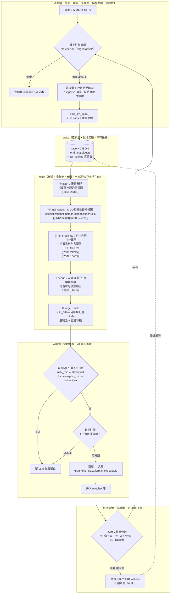
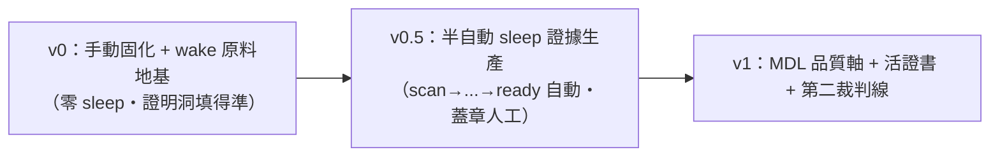

# 固化引擎 v0 工程藍圖

> **一句話**：把今夜反覆指向的旗艦碰撞——「ai_core 固化引擎 ＝ AI設計討論 bucket-brigade 經濟淘汰 ＝ 論文 wake-sleep 庫學習」——三者其實是**同一台機器的三種語言**。本檔把它落成一條可開工的離線管線：
> **wake（消費端就地收 ATP trace）→ sleep（離線貴智能：MDL 壓縮挑候選 + ILP 學判別謂詞 + e-graph 去重）→ 入庫（asset + grounding_class + 必要性閘）→ 經濟淘汰（命中率 / 描述長度 / LRU 破產）→ 消費端（便宜 matcher 高頻復用）。**

---

## 1. 目標與非目標

### 1.1 目標

1. **回答 roadmap §3.6 / §8 標「這題優先」的最硬未決題**——固化「誰做、自動還是手動、資產庫怎麼維護不爆炸」——給出**可寫成函數簽章、可分階段落地**的具體機制，而非願景句。
2. **把三方收斂成一條管線**：固化引擎（工程治理切面）借 wake-sleep（演算法骨架）與 bucket-brigade（經濟淘汰）補齊「sleep 內部具體長出什麼」與「庫怎麼維護」兩個既有圓桌沒答完的洞。
3. **把接地憲法 [[2601.05280]] 焊進資料結構**：每張證書一級欄位 `grounding_class`，並用「sleep 候選必重放 ast-verified 歷史 trace 才入庫」這條硬規則，把 αₜ>0 從定理變成 schema 約束。
4. **守住專案初心**：所有外部相依（句嵌入、ILP 求解器）只准活在 **sleep 工廠側**；產物一律是**純標準庫、離散、可確定性驗證**的 matcher，不滲笨模型消費端（`dependencies=[]` 不破）。

### 1.2 非目標（劃線排除，避免「愈做愈大」）

- **不做** v0 的自動領地擴張：v0 全手動固化，sleep 只到「證據生產」，**領地擴張需人蓋章**（承前案 K6）。
- **不做** 神經/可微固化：DiffLogic「鬆弛訓練→結晶」[[2506.04912]] 只當**比喻範式**，不引入梯度（與零相依硬衝）。
- **不做** 跨框架共享庫：DreamProver 鐵證引理庫**領域特定** [[2604.26311]]——每框架各演化一座庫。
- **不做** 連續潛在搜尋（LPN/NLI）：需訓練網路、潛在不可驗證，與治理正面矛盾（負面火花）。
- **不做** regime 自主調節 [[2606.26294]]/紅皇后活證書：留 v1+，v0/v0.5 人工切 regime。

---

## 2. 三方術語對照表（同一台機器的三種語言）

> 讀法：每一列是**同一個東西**在三個敘事裡的名字。中間欄＝本藍圖採用的統一機制。

| 機器零件 | 【核】ai_core 固化引擎 | 【設】bucket-brigade 經濟淘汰 | 【論】wake-sleep 庫學習 |
|---|---|---|---|
| **整圈** | 飛輪＝寬鬆→嚴格的遷移（撤照 + 認證）§3.5 | 插槽市場演化（收入 / 破產） | wake-sleep 庫學習迴圈 [[2604.26311]] |
| **原料收集** | trace[] NDJSON 記 LLM 留白 io pairs（wake）| base 解題器軌跡（哪題救活/破產）| wake：解題收「可學習中間定理」[[2604.26311]] |
| **離線抽象** | sleep：貴智能掃 trace → 提案 matcher | 貴搜尋發現可重用元件 / 詞彙表 | sleep：語意分群 → 抽象引理 [[2604.26311]] |
| **候選優選準則** | 命中率 ÷ 描述長度（MDL）| 節點財富（收入 − upkeep）| MDL savings；specialization≈Huffman、composition≈BPE [[2603.25975]][[2512.06104]] |
| **判別謂詞學習** | 必要性閘＝謂詞可乾淨分離與否 | Q-table 修復啟發法 | ILP 提名判別謂詞（CEGIS）[[2606.24245]][[2507.16405]] |
| **去重** | AST 正規化等價類，留最小代表 | 候選輸出雜湊相同者合併報價 | 樹編輯距離 / e-graph [[2604.26311]][[2501.17848]] |
| **庫維護上限** | 資產庫 <100 + LRU | 破產淘汰（接不到單退役）| LRU 遺忘維持 <100，緊湊抽象庫 > 龐大低階庫 [[2604.26311]] |
| **接地 / 裁判** | 證書 `certificate` + ast.parse verifier §3.4 | 財富淘汰 + ARC 客觀裁判 | αₜ>0、formal_executable verifier 才免疫 [[2601.05280]] |
| **化失敗為資產** | retry 失敗 trace relabel 成 few-shot | —（本藍圖補入）| hindsight relabel：對自身輸出必然正確 [[2507.14172]] |
| **消費端** | 笨模型 + 行數助手在窄洞填碼 §5 | base 解題器組候選（即丟）| 帶庫輕量推論（先直證、退 sketch）[[2604.26311]] |

**對照表的三句話**：① 同一條時間軸＝工廠→資產→消費者；② 同一個生死閘門＝接地訊號（證書／財富／αₜ 是同物三名）；③ 同一個飛輪＝把活的固化、把死的淘汰（撤照／破產／LRU 遺忘）。

---

## 3. 架構



**讀圖**：wake 在消費端就地寫 NDJSON（廉價、不可後補）；sleep 是**離線批次**，五步 ①→⑤ 把礦煉成候選；入庫閘 ready()→必要性→蓋章三道把關（這是唯一「主動擴張確定性領地」的動作，故預設拒絕）；經濟淘汰維持庫 <100，撤照只切路由不刪資產。**貴智能與外部相依全鎖在 SLEEP 框內，產物（matcher）純標準庫流回 CONSUME。**

---

## 4. 資料結構與介面草案

### 4.1 ATP asset schema 的固化增量（在 round_2_synthesis.md 已凍 schema 上加，不改寫上游）

```jsonc
{
  // ... 既有 ATP v0 欄位（asset_id / trace_id / origin / payload / pruning / target / validity）不動 ...

  "certificate": {
    "v": 1,
    "model": "ollama:qwen2.5-coder:7b",
    "action": "code_edit",
    "status": "uncertified",          // ∈ {uncertified, syntax_ok, rejected, approved(v1)}

    // ── 接地憲法（火花1 / [[2601.05280]]）：一級欄位，標明此留白靠什麼接地 ──
    "grounding_class": "formal_executable",  // ∈ {formal_executable, learned, static_proxy}
    "verifier_ref": "ast.parse + signature + anchor_exists + isolation_run",
    "alpha_source": "replay_against_ast_verified_traces",  // αₜ 的具體來源（外生於固化迴圈）

    // ── 固化品質軸（火花10/11/13 + MDL 角度 e）──
    "mdl_bits": 210,                  // 資產描述長度（位元）；優選＝命中率÷mdl_bits（CompressARC）
    "hit_rate": 0.83,                 // matcher 在歷史 trace 的命中比例
    "coverage": 0.91,                 // 規則命中比例（低＝藏起的查表，測謊器）
    "holdout": 0.88,                  // 封存 trace stability（唯一裁判，一票否決脆化）
    "necessity": "irreducible",       // ∈ {separable→撤照候選, irreducible→誠實留 LLM}

    // ── 可逆 / 溯源（前案 K4 / SGA 三重籠子）──
    "forged_from": ["t-9b21", "t-9c07"],   // 由哪些 trace 煉出
    "asset_ref": "a-3d1f",                 // 指回三明治骨架，撤照無損可逆
    "revocations": 0,                      // 撤照前科計數（≥1 禁全自動重固化）

    "test_set": "holdout_v0", "stability": 0.97, "issued_at": "...", "trace_id": "t-9b21"
  }
}
```

### 4.2 wake span（trace NDJSON 的固化原料；前案 §6 缺口，v0 就該補、不可後補）

```jsonc
{"stage":"consume","tool":"sfc.py","ok":false,
 "io":{"in":{"anchor_ctx":"...","sig":"def route(req):"},
       "out":"...","digest":"sha256:..."},   // 大 payload 存 digest+旁路檔
 "cert_draft":{"grounding_class":"formal_executable","ast_verified":true}}
```

### 4.3 固化決策函數簽章（sleep 五步 + 入庫 + 淘汰；全部是普通 ai_core 函數，遞迴閉合）

```python
# ── wake（消費端・零新依賴・純標準庫）─────────────────────────
def emit_llm_span(trace_id: str, *, anchor_ctx: dict, io: dict,
                  cert_draft: dict) -> None:
    """每次 LLM 留白命中 append 一筆 span 到 NDJSON。ast_verified 為 αₜ 真值錨。"""

# ── sleep（離線・貴智能・低頻；嵌入/ILASP 等外部相依只准在此）──
def scan(traces: TraceStore) -> list[Cluster]:
    """語意分群找『反覆出現的同類洞』。嵌入模型在此（工廠側），不滲消費端。[[2604.26311]]"""

def mdl_select(cluster: Cluster) -> list[ForgeProposal]:
    """對每簇用 MDL/壓縮挑『最短能解釋該簇』的 matcher/snippet 候選。
       savings = n·c_old − (c_lib + n·c_new)；優選準則＝命中率÷描述長度。
       [[2512.06104]] [[2603.25975]]"""

def ilp_predicate(pos: list[Span], neg: list[Span],
                  pred_lib: PredicateLib) -> Predicate | None:
    """FP 當負例、FN 當正例餵 ILP（ILASP/Popper），求最具判別力謂詞。
       回 None＝找不到乾淨分離（→ necessity=irreducible，誠實留 LLM）。
       [[2606.24245]] [[2507.16405]]"""

def dedup(proposal: ForgeProposal, library: AssetLib) -> ForgeProposal | None:
    """AST 正規化（改名/常數摺疊/交換律）+ 樹編輯距離；落既有等價類回 None。
       只做保守單步正規化，不追完備等價（會指數爆炸）。[[2501.17848]]"""

def forge(target: Anchor, pairs: list[IOPair], *, policy: ForgePolicy) -> Asset:
    """編成 with_fallback(新規則, 原LLM) 三明治（前案 judge round2），產 forged
       asset + 證書草稿；hindsight relabel：過 ast 閘的失敗 trace 也回收成 asset。
       [[2507.14172]]"""

# ── 入庫閘（領地擴張・三重籠子・v0 需蓋章）──────────────────
def ready(c: Candidate, *, n_min=30, theta=0.95, c_min=0.7) -> ReadyVerdict:
    """四道 AND 閘：n≥n_min ∧ stability≥θ ∧ coverage≥c_min ∧ holdout_ok。
       閘掛 coverage/holdout（不掛 stability，後者在 test_set 100% 是零信息量）。"""

def admit(asset: Asset, v: ReadyVerdict, *, stamp: Approval | None) -> AdmitResult:
    """必要性閘(ilp 可分離) + grounding_class 檢核 + 蓋章。
       v0：領地擴張一律需 stamp；override 表無痛擴張可全自動。"""

# ── 經濟淘汰（庫維護・<100+LRU・可逆）──────────────────────
def evict(library: AssetLib, *, cap=100,
          w=(1.0, 0.3, 0.5)) -> list[AssetId]:
    """破產分數 = w₁·hit_rate − w₂·mdl_bits_norm − w₃·lru_staleness。
       超容量/破產 → 撤照＝路由切回 fallback，不刪資產（K4 可逆）。"""
```

### 4.4 固化引擎 = 三段 chain 的編排（比 forge 高一階，承前案 K5）

```
scan(生態) → 候選簇 ∘ prioritize(候選, trace頻率) → 排程 ∘ forge(目標, pairs, policy) → forged 資產
```

> sleep 五步即 `scan→mdl_select→ilp_predicate→dedup→forge`；`prioritize` 用 trace 頻率排序把貴智能呼叫集中在「高頻同類洞」（呼應 §2 成本梯度）。**v0 對「ready() 准入判斷」本身保持 `nondeterministic:true` 不自我固化**——別讓飛輪自己拆掉自己的剎車（前案 §7）。

---

## 5. 與崩潰定理 [[2601.05280]] 對齊：接地訊號從哪來、為何不會自我污染

崩潰定理證明：遞迴自我訓練在外部接地比例 αₜ→0 時**必崩**（熵衰減 + 方差放大 + DPI 封閉），且 **verifier 種類決定生死**——formal_executable 免疫、learned 會崩、static proxy 被 Goodhart。本藍圖逐條對齊：

### 5.1 接地訊號（αₜ）的具體來源

| 接地來源 | 在本管線的位置 | grounding_class |
|---|---|---|
| **ast.parse + 簽名 + 錨點存在 + 隔離執行** | 消費端確定性驗證、sleep 候選重放驗證 | `formal_executable`（免疫檔）|
| 人類意圖翻譯層 | 上游意圖→結構化意圖 | `learned`（憲法明寫豁免：人類在迴路 + 證書降級）|
| 靜態 benchmark proxy | **禁用為唯一閘**（Goodhart 帶）| `static_proxy`（標旗標、不准當固化唯一裁判）|

> αₜ 的工程實現 = **「sleep 抽象的候選必須重放歷史 trace 並通過 ast 確定性驗證才入庫」這條硬規則**。重放的真值來自 wake 期 ast_verified 的 io pairs——這是**外生於固化迴圈**的（請求由人類意圖驅動、真值由程式執行裁定），不是固化引擎自生的標籤。αₜ≥α*>0 因此恆成立（Thm 5：有下界即收斂真分布）。

### 5.2 為何不會自我污染（四道防線）

1. **驗證器是 formal_executable，非 learned**：禁止用 LLM-as-judge 當任一環節**唯一**閘門（learned verifier 會崩）。固化提案的生死由 `ast.parse` 裁，不由 LLM 裁。
2. **外部相依鎖在工廠側**：嵌入模型（scan 分群）、ILP 求解器（ilp_predicate）只活在離線 sleep；**產物是純標準庫 matcher**，消費端 αₜ 不被 sleep 的 learned 成分污染（消費端永遠 `dependencies=[]`）。
3. **訓練訊號外生**：MDL 壓縮的對象是**真實 trace**（人類意圖驅動的真實請求），不是模型自生分佈；holdout 用**封存 trace** 當外生保留集——避免「便宜模型生資產→便宜模型消費→回灌」的 α→0 自指迴圈。
4. **必要性閘 + 誠實留白**：ILP 找不到乾淨分離（`necessity=irreducible`）→ **誠實留 LLM**，不強行固化成脆規則。固化一個本質模糊的東西＝用脆規則假裝接地，比留白更糟（前案 §3）。**固化預設姿態＝拒絕**：錯誤固化的傷害 silent + 永久 + 監督退場後發生，嚴格高於 LLM 犯錯。

### 5.3 符號錨對齊

forged matcher 是離散程式——**不能微量漂移**，要改就跳到下一個有效 matcher，形成位能障壁，把連續漂移離散化（[[2601.05280]] §3.3 符號錨）。三層 fail-closed 安全護欄＝符號投影算子（把漂移投影回最近有效程式）。

---

## 6. 分階段落地里程碑與風險



### v0：手動固化 + wake 原料地基（與 ATP v0 一起做）

- **做**：跑通 ATP v0 切片（`asset→trace→skeleton→isolation→line_assistant→demos`）；**trace.py 補 `io` 欄位 + 證書補 `grounding_class`**（廉價、不可後補——歷史 trace 丟了就丟了）；固化全手動（人觀察、人寫 with_fallback 三明治）。
- **不做**：任何 sleep 自動化、外部相依、經濟淘汰。
- **驗收**：對照組（raw 笨模型）失敗、實驗組（鷹架 + 手動 matcher）成功；wake 原料開始累積。
- **風險**：原料缺口若不在 v0 補，後續 sleep 無米下鍋。**對策**：io 欄位是 v0 唯一現在就必做的固化動作。

### v0.5：半自動 sleep 的「證據生產」（領地擴張仍需蓋章）

- **做**：sleep 五步 `scan→mdl_select→ilp_predicate→dedup→forge` 全自動產候選 + 證書草稿 + `ready()` 四閘自動判；`admit` 的**蓋章仍人工**。經濟淘汰 `evict`（LRU + 命中率）上線維持庫 <100。外部相依（句嵌入、ILASP/Popper）引入但**隔離在 sleep CLI**，產物純標準庫驗證後才進庫。
- **驗收**：A/B 淨贏判據——`固化後 holdout ≥ 固化前 LLM holdout − ε ∧ save>0 ∧ coverage 合理`；ILP 4–5 次迭代收斂、規則可讀（[[2606.24245]]）。
- **風險**：(a) 引理庫**領域特定**[[2604.26311]]——每框架各演化一座，別假設跨框架共享；(b) ILP 謂詞庫需種子——用 ATP `SENSITIVE_NAMES` 黑名單當起點；(c) 語意分群嵌入與零相依衝突——**只准工廠側**；(d) coverage 低＝藏起的查表，必拒（測謊器）。

### v1：MDL 品質軸 + 活證書 + 第二裁判線

- **做**：固化優選準則從「命中率」升級為「**命中率 ÷ 描述長度（MDL）**」[[2512.06104]]；紅皇后活證書防 Goodhart（世代內凍結評估者、邊界換挑戰者、選擇性抹除）[[2606.26294]]；開第二條 ARC 客觀裁判線交叉驗證飛輪是否真在轉 [[2601.10904]]。
- **不做**：regime 自主調節（留 v2，人工切 regime 即可）。
- **風險**：紅皇后收斂保證鬆動（僅保每世代內）、重認證有成本——世代切夠粗以免抖動。

---

## 7. 收束：這份藍圖補了既有圓桌的哪一塊

前案 `crystallization_round_1_synthesis.md` 已定**何時固化（ready 四閘）+ 怎麼治理（三重籠子）+ 系統形態（三段 chain）+ 怎麼換規則（with_fallback 三明治）**。本藍圖用論文火花補上前案明說「真正難題」之外、**尚缺的「sleep 內部演算法引擎」與「庫維護量化準則」**：

- **sleep 長出什麼**：`mdl_select`（MDL 挑最短候選）+ `ilp_predicate`（ILP 學判別謂詞＝必要性閘的可操作判定）+ `dedup`（e-graph/AST 去重）——前案的 `train` 只說「對單一目標固化」，這裡給它離線抽象的五步實體。
- **庫怎麼不爆炸**：`<100 + LRU + 破產分數`，由 DreamProver 消融鐵證（104→76→53，緊湊抽象庫 > 龐大低階庫）背書。
- **接地憲法落到欄位**：`grounding_class` + 「重放 ast-verified trace 才入庫」＝ αₜ>0 的 schema 約束。
- **化失敗為資產**：hindsight relabel [[2507.14172]] 補進 forge，過 ast 閘的失敗 trace 也回收。

> 全程守一條線：**貴智能與外部相依只在「離線、低頻」的 sleep 工廠側出現，產物一律純標準庫、離散、可確定性驗證**；消費端維持零相依。這正是 roadmap §2「貴智能產抽象 → 便宜智能高頻復用」的固化版具體化。
</content>
</invoke>
