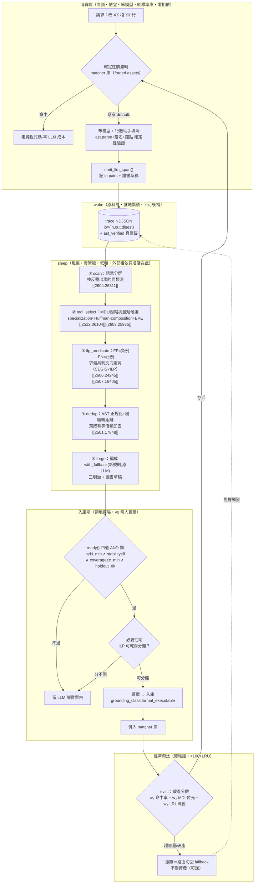

## 1. 目標與非目標

### 1.1 目標

1. **回答 roadmap §3.6 / §8 標「這題優先」的最硬未決題**——固化「誰做、自動還是手動、資產庫怎麼維護不爆炸」——給出**可寫成函數簽章、可分階段落地**的具體機制，而非願景句。
2. **把三方收斂成一條管線**：固化引擎（工程治理切面）借 wake-sleep（演算法骨架）與 bucket-brigade（經濟淘汰）補齊「sleep 內部具體長出什麼」與「庫怎麼維護」兩個既有圓桌沒答完的洞。
3. **把接地憲法 [[2601.05280]] 焊進資料結構**：每張證書一級欄位 `grounding_class`，並用「sleep 候選必重放 ast-verified 歷史 trace 才入庫」這條硬規則，把 αₜ>0 從定理變成 schema 約束。
4. **守住專案初心**：所有外部相依（句嵌入、ILP 求解器）只准活在 **sleep 工廠側**；產物一律是**純標準庫、離散、可確定性驗證**的 matcher，不滲笨模型消費端（`dependencies=[]` 不破）。

### 1.2 非目標（劃線排除，避免「愈做愈大」）

- **不做** v0 的自動領地擴張：v0 全手動固化，sleep 只到「證據生產」，**領地擴張需人蓋章**（承前案 K6）。
- **不做** 神經/可微固化：DiffLogic「鬆弛訓練→結晶」[[2506.04912]] 只當**比喻範式**，不引入梯度（與零相依硬衝）。
- **不做** 跨框架共享庫：DreamProver 鐵證引理庫**領域特定** [[2604.26311]]——每框架各演化一座庫。
- **不做** 連續潛在搜尋（LPN/NLI）：需訓練網路、潛在不可驗證，與治理正面矛盾（負面火花）。
- **不做** regime 自主調節 [[2606.26294]]/紅皇后活證書：留 v1+，v0/v0.5 人工切 regime。

---

## 2. 三方術語對照表（同一台機器的三種語言）

> 讀法：每一列是**同一個東西**在三個敘事裡的名字。中間欄＝本藍圖採用的統一機制。

| 機器零件 | 【核】ai_core 固化引擎 | 【設】bucket-brigade 經濟淘汰 | 【論】wake-sleep 庫學習 |
|---|---|---|---|
| **整圈** | 飛輪＝寬鬆→嚴格的遷移（撤照 + 認證）§3.5 | 插槽市場演化（收入 / 破產） | wake-sleep 庫學習迴圈 [[2604.26311]] |
| **原料收集** | trace[] NDJSON 記 LLM 留白 io pairs（wake）| base 解題器軌跡（哪題救活/破產）| wake：解題收「可學習中間定理」[[2604.26311]] |
| **離線抽象** | sleep：貴智能掃 trace → 提案 matcher | 貴搜尋發現可重用元件 / 詞彙表 | sleep：語意分群 → 抽象引理 [[2604.26311]] |
| **候選優選準則** | 命中率 ÷ 描述長度（MDL）| 節點財富（收入 − upkeep）| MDL savings；specialization≈Huffman、composition≈BPE [[2603.25975]][[2512.06104]] |
| **判別謂詞學習** | 必要性閘＝謂詞可乾淨分離與否 | Q-table 修復啟發法 | ILP 提名判別謂詞（CEGIS）[[2606.24245]][[2507.16405]] |
| **去重** | AST 正規化等價類，留最小代表 | 候選輸出雜湊相同者合併報價 | 樹編輯距離 / e-graph [[2604.26311]][[2501.17848]] |
| **庫維護上限** | 資產庫 <100 + LRU | 破產淘汰（接不到單退役）| LRU 遺忘維持 <100，緊湊抽象庫 > 龐大低階庫 [[2604.26311]] |
| **接地 / 裁判** | 證書 `certificate` + ast.parse verifier §3.4 | 財富淘汰 + ARC 客觀裁判 | αₜ>0、formal_executable verifier 才免疫 [[2601.05280]] |
| **化失敗為資產** | retry 失敗 trace relabel 成 few-shot | —（本藍圖補入）| hindsight relabel：對自身輸出必然正確 [[2507.14172]] |
| **消費端** | 笨模型 + 行數助手在窄洞填碼 §5 | base 解題器組候選（即丟）| 帶庫輕量推論（先直證、退 sketch）[[2604.26311]] |

**對照表的三句話**：① 同一條時間軸＝工廠→資產→消費者；② 同一個生死閘門＝接地訊號（證書／財富／αₜ 是同物三名）；③ 同一個飛輪＝把活的固化、把死的淘汰（撤照／破產／LRU 遺忘）。

---

## 3. 架構

**讀圖**：wake 在消費端就地寫 NDJSON（廉價、不可後補）；sleep 是**離線批次**，五步 ①→⑤ 把礦煉成候選；入庫閘 ready()→必要性→蓋章三道把關（這是唯一「主動擴張確定性領地」的動作，故預設拒絕）；經濟淘汰維持庫 <100，撤照只切路由不刪資產。**貴智能與外部相依全鎖在 SLEEP 框內，產物（matcher）純標準庫流回 CONSUME。**
