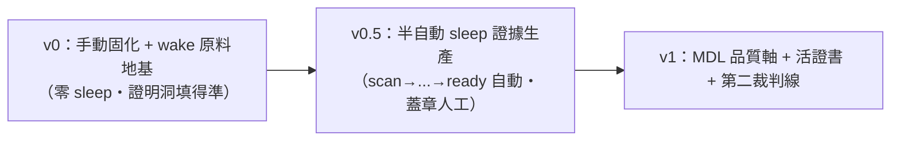

## 5. 與崩潰定理 [[2601.05280]] 對齊：接地訊號從哪來、為何不會自我污染

崩潰定理證明：遞迴自我訓練在外部接地比例 αₜ→0 時**必崩**（熵衰減 + 方差放大 + DPI 封閉），且 **verifier 種類決定生死**——formal_executable 免疫、learned 會崩、static proxy 被 Goodhart。本藍圖逐條對齊：

### 5.1 接地訊號（αₜ）的具體來源

| 接地來源 | 在本管線的位置 | grounding_class |
|---|---|---|
| **ast.parse + 簽名 + 錨點存在 + 隔離執行** | 消費端確定性驗證、sleep 候選重放驗證 | `formal_executable`（免疫檔）|
| 人類意圖翻譯層 | 上游意圖→結構化意圖 | `learned`（憲法明寫豁免：人類在迴路 + 證書降級）|
| 靜態 benchmark proxy | **禁用為唯一閘**（Goodhart 帶）| `static_proxy`（標旗標、不准當固化唯一裁判）|

> αₜ 的工程實現 = **「sleep 抽象的候選必須重放歷史 trace 並通過 ast 確定性驗證才入庫」這條硬規則**。重放的真值來自 wake 期 ast_verified 的 io pairs——這是**外生於固化迴圈**的（請求由人類意圖驅動、真值由程式執行裁定），不是固化引擎自生的標籤。αₜ≥α*>0 因此恆成立（Thm 5：有下界即收斂真分布）。

### 5.2 為何不會自我污染（四道防線）

1. **驗證器是 formal_executable，非 learned**：禁止用 LLM-as-judge 當任一環節**唯一**閘門（learned verifier 會崩）。固化提案的生死由 `ast.parse` 裁，不由 LLM 裁。
2. **外部相依鎖在工廠側**：嵌入模型（scan 分群）、ILP 求解器（ilp_predicate）只活在離線 sleep；**產物是純標準庫 matcher**，消費端 αₜ 不被 sleep 的 learned 成分污染（消費端永遠 `dependencies=[]`）。
3. **訓練訊號外生**：MDL 壓縮的對象是**真實 trace**（人類意圖驅動的真實請求），不是模型自生分佈；holdout 用**封存 trace** 當外生保留集——避免「便宜模型生資產→便宜模型消費→回灌」的 α→0 自指迴圈。
4. **必要性閘 + 誠實留白**：ILP 找不到乾淨分離（`necessity=irreducible`）→ **誠實留 LLM**，不強行固化成脆規則。固化一個本質模糊的東西＝用脆規則假裝接地，比留白更糟（前案 §3）。**固化預設姿態＝拒絕**：錯誤固化的傷害 silent + 永久 + 監督退場後發生，嚴格高於 LLM 犯錯。

### 5.3 符號錨對齊

forged matcher 是離散程式——**不能微量漂移**，要改就跳到下一個有效 matcher，形成位能障壁，把連續漂移離散化（[[2601.05280]] §3.3 符號錨）。三層 fail-closed 安全護欄＝符號投影算子（把漂移投影回最近有效程式）。

---

## 6. 分階段落地里程碑與風險

### v0：手動固化 + wake 原料地基（與 ATP v0 一起做）

- **做**：跑通 ATP v0 切片（`asset→trace→skeleton→isolation→line_assistant→demos`）；**trace.py 補 `io` 欄位 + 證書補 `grounding_class`**（廉價、不可後補——歷史 trace 丟了就丟了）；固化全手動（人觀察、人寫 with_fallback 三明治）。
- **不做**：任何 sleep 自動化、外部相依、經濟淘汰。
- **驗收**：對照組（raw 笨模型）失敗、實驗組（鷹架 + 手動 matcher）成功；wake 原料開始累積。
- **風險**：原料缺口若不在 v0 補，後續 sleep 無米下鍋。**對策**：io 欄位是 v0 唯一現在就必做的固化動作。

### v0.5：半自動 sleep 的「證據生產」（領地擴張仍需蓋章）

- **做**：sleep 五步 `scan→mdl_select→ilp_predicate→dedup→forge` 全自動產候選 + 證書草稿 + `ready()` 四閘自動判；`admit` 的**蓋章仍人工**。經濟淘汰 `evict`（LRU + 命中率）上線維持庫 <100。外部相依（句嵌入、ILASP/Popper）引入但**隔離在 sleep CLI**，產物純標準庫驗證後才進庫。
- **驗收**：A/B 淨贏判據——`固化後 holdout ≥ 固化前 LLM holdout − ε ∧ save>0 ∧ coverage 合理`；ILP 4–5 次迭代收斂、規則可讀（[[2606.24245]]）。
- **風險**：(a) 引理庫**領域特定**[[2604.26311]]——每框架各演化一座，別假設跨框架共享；(b) ILP 謂詞庫需種子——用 ATP `SENSITIVE_NAMES` 黑名單當起點；(c) 語意分群嵌入與零相依衝突——**只准工廠側**；(d) coverage 低＝藏起的查表，必拒（測謊器）。

### v1：MDL 品質軸 + 活證書 + 第二裁判線

- **做**：固化優選準則從「命中率」升級為「**命中率 ÷ 描述長度（MDL）**」[[2512.06104]]；紅皇后活證書防 Goodhart（世代內凍結評估者、邊界換挑戰者、選擇性抹除）[[2606.26294]]；開第二條 ARC 客觀裁判線交叉驗證飛輪是否真在轉 [[2601.10904]]。
- **不做**：regime 自主調節（留 v2，人工切 regime 即可）。
- **風險**：紅皇后收斂保證鬆動（僅保每世代內）、重認證有成本——世代切夠粗以免抖動。

---

## 7. 收束：這份藍圖補了既有圓桌的哪一塊

前案 `crystallization_round_1_synthesis.md` 已定**何時固化（ready 四閘）+ 怎麼治理（三重籠子）+ 系統形態（三段 chain）+ 怎麼換規則（with_fallback 三明治）**。本藍圖用論文火花補上前案明說「真正難題」之外、**尚缺的「sleep 內部演算法引擎」與「庫維護量化準則」**：

- **sleep 長出什麼**：`mdl_select`（MDL 挑最短候選）+ `ilp_predicate`（ILP 學判別謂詞＝必要性閘的可操作判定）+ `dedup`（e-graph/AST 去重）——前案的 `train` 只說「對單一目標固化」，這裡給它離線抽象的五步實體。
- **庫怎麼不爆炸**：`<100 + LRU + 破產分數`，由 DreamProver 消融鐵證（104→76→53，緊湊抽象庫 > 龐大低階庫）背書。
- **接地憲法落到欄位**：`grounding_class` + 「重放 ast-verified trace 才入庫」＝ αₜ>0 的 schema 約束。
- **化失敗為資產**：hindsight relabel [[2507.14172]] 補進 forge，過 ast 閘的失敗 trace 也回收。

> 全程守一條線：**貴智能與外部相依只在「離線、低頻」的 sleep 工廠側出現，產物一律純標準庫、離散、可確定性驗證**；消費端維持零相依。這正是 roadmap §2「貴智能產抽象 → 便宜智能高頻復用」的固化版具體化。
