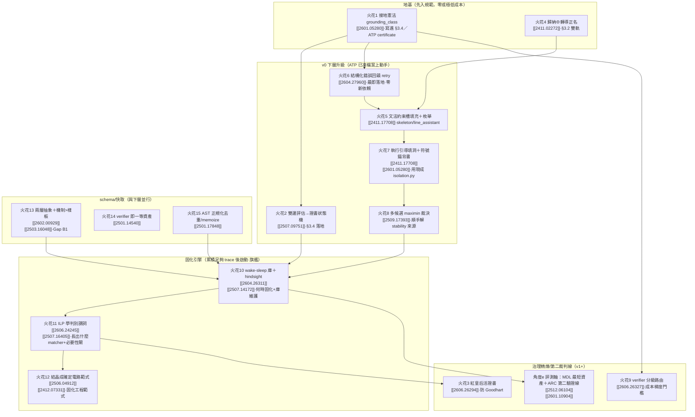

## (ii-附) 角度 (e) 專節：ARC 當裁判 × 「貴智能產最短/最簡資產」的評測軸

ai_core 北極星說「資產要折舊很慢、要省」，但 `roadmap.md §6` 的 v0 驗收只有「對照組失敗 vs 實驗組成功」一個二元判據，**缺一個量化「資產有多精簡/多接近最短程式」的軸**。角度 (e) 三篇正好補這塊：

| 來源 [[id]] | 給 ai_core 的東西 | 對映 roadmap |
|---|---|---|
| **CompressARC（MDL/壓縮即智能）[[2512.06104]]** | 把「解題」重述為「**找能印出資料集的最短自含程式**」（code-golf/MDL），由奧坎剃刀＝最短程式會正確泛化。對映：ai_core「貴智能產資產」的**品質軸＝資產的描述長度（MDL）**——同一個洞，**能用更短 matcher/snippet 接住的資產更優**。可把「固化提案」的優選準則從「命中率」升級為「**命中率 / 描述長度**」（CompressARC 損失各項類比 VAE KL/重建＝ai_core 的「泛化 vs 擬合」權衡） | §5 資產品質、§3.6 固化提案優選、§6 驗收新增「資產 MDL」軸 |
| **ARC Prize 2025（精煉迴圈）[[2601.10904]]** | 2025 的統一視角「**refinement loop＝以回饋訊號把某程式/某組權重迭代換成略好的版本**」——這**就是 ai_core 飛輪的外部同義詞**（程式空間 vs 權重空間只是換被精煉的對象）。且報告核心警訊「**當前推理被知識覆蓋綁死**」反向印證 ai_core 路線：把能力**固化成確定性程式碼**＝把「推理」與「知識記憶」分離，正是報告說「真正缺的新點子」 | §3.5 飛輪＝refinement loop、§3.4 分離知識/推理的合法性背書 |
| **ARC 當裁判（cross_fusion 提案 5 + 本三篇）** | ARC 是「最友善裁判」（少範例、結構 OOD、程式執行可驗證、完全客觀）。建議**開第二條驗證線**：把 ai_core「行數助手＋受約束生成＋retry/guard」鷹架，**同一套**套到 ARC 的 DSL 填洞任務上（DSL 填洞而非檔案填洞），用 [[2411.02272]] 歸納⊕轉導當對照基線，在客觀裁判下交叉驗證「飛輪是否真在轉」 | §6 第二條驗證線（與 §6.1 程式碼編輯線並行） |

> 關鍵連結：崩潰定理 [[2601.05280]] 在此與 (e) 握手——**「程式執行＝完美 verifier，免疫崩潰」正是 ARC 之所以是好裁判、也是 ai_core `ast.parse` 接地之所以成立的同一條原理**。三方（MDL 最短程式、ARC 客觀裁判、αₜ 接地定理）指向同一個 Solomonoff/AIXI 理想的可跑近似：**智能＝找出能解釋資料的最短程式**，ai_core 是它的「工程治理」切面。

---

## (iii) 建議落地優先序

**一句話排序**：先把**火花 1（接地憲法）＋火花 4（歸納⊕轉導正名）**寫進規範（地基、近零成本）；v0 下層按**火花 6→2→5→7→8**做成完整升級（全落在 ATP 已凍檔案，火花 6 最即落地）；schema 線**火花 13/14/15** 並行；待 `trace[]` 累積足夠，啟動固化雙旗艦**火花 10⊕11**、用火花 12 當工程範式；治理精煉（火花 3/9）與評測軸/ARC 第二線（角度 e）留 v1+。

---
