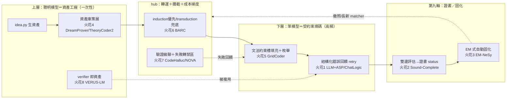

## 0. 一頁地圖：論文機制掛到哪個 ai_core 環節

ai_core v0 切片（`roadmap.md §6.1`，ATP v0）是一條 `idea.py`（工廠）→ `hub`（轉運＋攔截）→ `sfc.py`（消費）的 asset 流水線。下面把 8 個火花掛到對應環節：

---

## 火花 1 — 把「盲目 retry」升級成「結構化錯誤回饋 retry 環」

| 欄位 | 內容 |
|---|---|
| **來源** | LLM 當 ASP 程式設計師 [[2604.27960]]（求解器結構化錯誤驅動自我修正，平均 2.18 次迭代收斂）＋ ChatLogic [[2407.10162]]（語法修正吃執行錯誤訊息＋語意修正用反向翻譯，+13.9% 執行率） |
| **對應模組** | `roadmap.md §6.1` 的 `sfc.py` consume 階段 + `demos/v0_pipeline.py` 的 retry 環；ATP `trace[].reason`、`certificate.status` |

**具體做法（可落地步驟）**
1. v0 現況的 retry 只有「`ast.parse` 過／不過」的二元判斷，重試時 prompt 不變＝盲目重抽。改為：把確定性驗證器吐出的**結構化錯誤**（`SyntaxError` 的行列＋訊息、簽名不符的 expected/got、guardrail 命中的 `SENSITIVE_NAMES`）格式化成一段 `feedback` 字串。
2. 下一輪 `llm_call` 的 context binding（元件 2 `lib/llm_call.py`）疊上這段 feedback，並把上一輪的錯誤輸出一併貼回，要小模型「只改錯的地方」。
3. 仿 [[2604.27960]] 的「context rot」發現：給笨模型的不是完整 API 文件，而是**裁剪過的精簡參考**（接火花 4／8 的資產庫），錯誤回饋也只貼相關片段。
4. 把每輪的 `{attempt, reason, fixed?}` 追加進 ATP `trace[]`，迭代上限沿用 `lib/interact.py` 的 `max_rounds`。

**預期效益／風險**
- 效益：[[2604.27960]] 顯示結構化錯誤回饋讓弱模型 2~3 輪內收斂，正中 ai_core「用便宜小模型也能可靠」的初心；幾乎零新依賴（錯誤本來就有，只是沒回灌）。
- 風險：回饋可能誘發小模型「為迎合錯誤訊息而過擬合」局部修補卻破壞他處 → 用 `ast` 全檔重驗（已有）擋住；max_rounds 防 actor↔critic 無限互踢。

**roadmap 落點**：v0 切片 `demos/v0_pipeline.py` retry 環的第一個增量；順帶逼出 `DECISIONS.md B1`（精簡參考＝語意欄位）。

---

## 火花 2 — 雙邊事實性評估 → 給第九軸證書一個「真的不確定」的合法狀態

| 欄位 | 內容 |
|---|---|
| **來源** | 健全且完整的 NeSy 推理 [[2507.09751]]（對每原子問兩次「能驗證？能反駁？」映成 Belnap 四值；快取函數 ζ_c 保證一致賦值，矛盾被局部化不爆炸） |
| **對應模組** | 第九軸 `nondeterministic` 證書（`roadmap.md §3.4`）；ATP `certificate.status ∈ {uncertified, syntax_ok, rejected}`；`lib/memoize.py` |

**具體做法**
1. v0 證書 status 是單邊的（過 ast → `syntax_ok`，否則 `rejected`）。引入**雙邊驗證**：對一份生成片段同時問兩件事——「能否**確認**正確？」（`ast.parse` 過＋簽名符＋目標節點存在）與「能否**找到反例**？」（`execute_in_isolation` 跑最小測試）。
2. 映成四象限狀態：⟨確認✓，無反例⟩→`syntax_ok`（可寫檔／可進認證流程）；⟨確認✗，有反例⟩→`rejected`；⟨確認✗，無反例⟩→**保持 `uncertified` 並標 `nondeterministic:true`**——這正是 `roadmap.md §3.1` 那個「永遠不會閉合的模糊前沿」，誠實標記它，而非假裝 rejected 或假裝 ok。
3. 仿 ζ_c 快取：用 `lib/memoize.py` 對 `sha256(片段+測試集)` 快取狀態，保證同一 asset 重評得到同一證書（可稽核性的前提）。

**預期效益／風險**
- 效益：把 `roadmap.md §3.4`「拒絕為預設＋憑證准入」從口號變成**可計算的狀態機**——證書不再是「過/不過」，而是「確認/反駁」兩個獨立確定性測量的合成，天然標出哪些洞是真模糊（該留 LLM）哪些是能力不足（該 retry／升級）。
- 風險：需要 `execute_in_isolation` 能跑出最小反例測試，v0 只有軟隔離（`subprocess env 白名單`）→ 先只對無副作用片段開反例測試，有副作用者退回單邊。

**roadmap 落點**：`roadmap.md §3.4` 治理原則落地；擴充 ATP `certificate` 欄與 `validity` 欄；連動 `DECISIONS.md C`（第九軸）。

---

## 火花 3 — EM 解耦 → 攻「最硬未決題」：固化引擎自動 vs 手動（§3.6）

| 欄位 | 內容 |
|---|---|
| **來源** | EM-NeSy [[2606.14463]]（把 NeSy 重鑄成 EM：E 步用**任意不可微推論引擎**算後驗、M 步只更新神經組件；徹底解耦「約束滿足」與「優化目標」） |
| **對應模組** | `roadmap.md §3.6 / §8` 固化（crystallization）引擎——標「這題優先」的最硬未決題 |

**具體做法**
1. `roadmap.md §3.6` 卡在「固化（把 LLM 老在處理的同類模糊案例凍成確定性 matcher）誰來做」：手動＝工具、自動＝自我改進系統。EM 提供一個**不需要可微、不需要聰明模型每次在線**的自動固化框架：
   - **E 步（確定性、不可微）**：掃 ATP `trace[]` 落盤的 NDJSON，對「同一錨點型態／同一錯誤 reason」的案例做聚類（純 `ast` 結構特徵 + reason 標籤），算出「哪一類案例佔了 LLM 多少呼叫」的後驗分佈——對應 EM 的 E 步用任意引擎算 p(z|y)。
   - **M 步（只更新確定性層）**：對後驗質量最大的那一類，由**聰明模型一次性**提案一個新的確定性 matcher／snippet 模板（`roadmap.md §3.2` 的前濾網分支），加入資產庫。梯度（聰明模型算力）只花在 M 步，E 步全是免費的確定性統計。
2. 收斂條件：當某類案例的「LLM 命中率」被新 matcher 攔截到趨近 0，該類即完成固化（撤照，`roadmap.md §3.5` 飛輪）。

**預期效益／風險**
- 效益：把「自動固化」從「需要一個會自我改進的大系統」降規成「**離線統計（E）＋稀疏的聰明模型提案（M）**」，完全契合 ai_core「聰明模型稀有、一次性」的成本模型；E 步純標準庫（`ast`/`json`），不破壞 `dependencies=[]`。
- 風險：聚類的「同類」判準若太粗 → 固化出過度泛化的 matcher（誤攔本該走 LLM 的案例）；用火花 2 的證書 status 當守門——只固化 `rejected/uncertified` 反覆出現的類，不動已 `syntax_ok` 的。

**roadmap 落點**：直接回答 `roadmap.md §8`「固化引擎手動 vs 自動（這題優先）」；給出一條「v0 先落 E 步離線統計、M 步暫手動」的漸進路徑。
