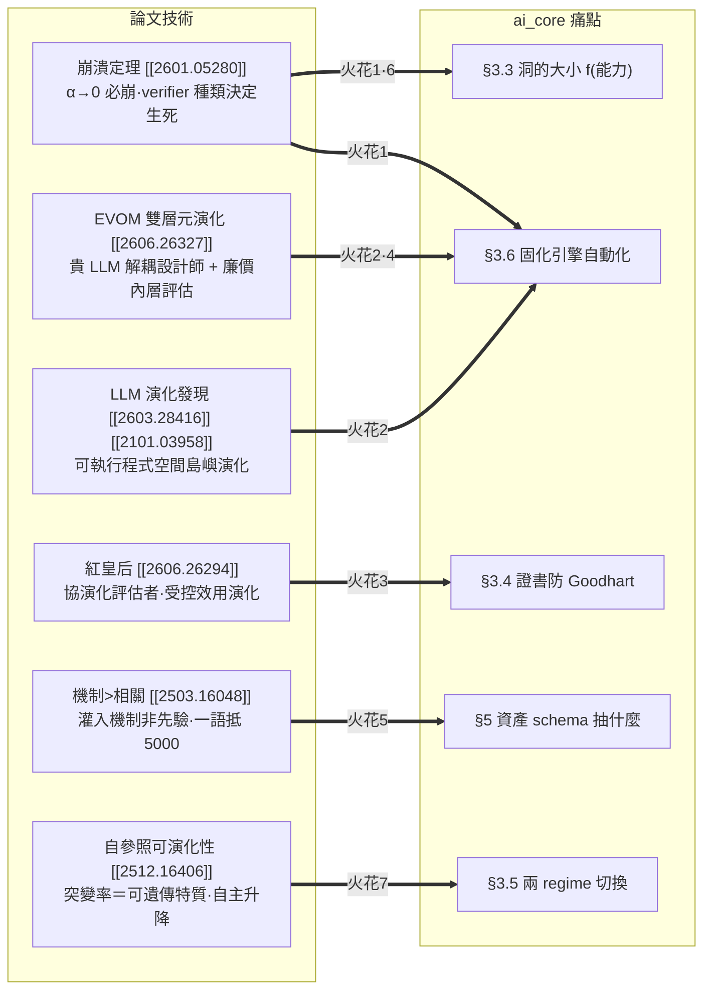

## 0. 一頁地圖

ai_core 的北極星有三塊最硬的東西尚未釘死（roadmap §3.6 / §3.4 / §8）：**固化引擎要不要自動化、證書怎麼防 Goodhart、兩 regime 何時切換**。這批「自我改進 agent」論文恰好各自啃過其中一塊。下圖把論文技術對準 ai_core 的痛點：

三條主軸（對應任務要求）：
- **(a) 接地訊號必要性** → 火花 1（飛輪硬約束）、火花 4（成本梯度分級）、火花 6（受約束生成的理論背書）。
- **(b) 貴智能改進便宜智能的分層迴圈** → 火花 2（固化引擎＝雙層元演化）、火花 5（資產抽機制非樣板）。
- **(c) 協同演化評估者把關品質** → 火花 3（紅皇后證書）、火花 7（regime 自主調節）。

---

## 火花 1：崩潰定理 → ai_core 飛輪的「接地憲法」

| 欄位 | 內容 |
|---|---|
| **來源技術** | [[2601.05280]] 崩潰定理：純自指（外部接地 αₜ→0）必然 mode collapse（Thm 2 熵衰減上鞅）+ 隨機漫步漂移（Thm 4 AR(1) 係數→1）+ DPI 保證自指不增互資訊（Cor 3）；只要 αₜ≥α*>0 就收斂真分布（Thm 5）。**verifier 種類決定生死**：完美可執行環境免疫、learned verifier（RLHF reward model）會崩、static proxy 被 Goodhart。 |
| **ai_core 問題** | roadmap §3.6 最硬未決——固化引擎「自動」版＝聰明模型掃 log 自動提案新分支。但若飛輪變成「便宜模型生資產 → 便宜模型消費 → 產出又回灌生資產」，這正是 αₜ→0 的自指迴圈，理論上**必崩**。ai_core 至今沒有一條成文規定保證飛輪不掉進這個陷阱。 |
| **具體做法** | 立一條**接地憲法**寫進 §3.4：①任何進 archive 的固化提案，都必須掛在一個**形式可執行 verifier**（ATP v0 已有的 `ast.parse` 過 + 目標節點存在 + 簽名符合 + 單元測試）才允許上線——這就是 ai_core 的 αₜ 來源，且是「免疫」那一檔。②**禁止**用「LLM-as-judge 對 LLM 產出打分」當某環節的**唯一**閘門（那是 learned verifier，會崩）。③把證書欄位升級：每張證書強制標 `grounding_class ∈ {formal_executable, learned, static_proxy}`，讓「這個留白靠什麼接地」變成可稽核的一級欄位，而非藏在穩定度 % 裡。 |
| **效益 / 風險** | 效益：給 ai_core 最偏執的設計信仰（凡事先確定性驗證）一個**動力系統層級的證明**，不再只是工程直覺；且 §6.1 ATP 的確定性驗證一夕之間從「實作細節」升格為「飛輪能否持續的命門」。風險：**意圖翻譯層天生沒有單元測試**——人類意圖無法形式驗證，這塊永遠是 learned/proxy 接地，憲法要明寫「此處豁免但須人類在迴路 + 證書降級標註」，否則會卡死。 |
| **roadmap 落點** | §3.4 證書欄位（加 `grounding_class`）、§3.5 飛輪、§3.6 固化引擎、§6.1 ATP certificate。**這是全篇的地基，其餘火花都站在它上面。** |

---

## 火花 2：EVOM 雙層元演化 + LLM 島嶼演化 → 把「固化引擎」做成可執行的搜尋演算法

| 欄位 | 內容 |
|---|---|
| **來源技術** | [[2606.26327]] EVOM 雙層最佳化：**外層一個純「設計師」LLM（與執行/環境完全解耦）**對 elite 種群做 mutation/crossover 提案「可執行架構程式」，**內層用低保真評估**給便宜 fitness，編譯失敗/崩潰罰 −1000 守衛。[[2603.28416]]：把 LLM 當變異算子，直接在**可執行更新規則程式碼空間**做島嶼種群演化，每候選用回放/訓練 run 端到端評估。[[2101.03958]] 證實「在程式/計算圖空間演化出可執行邏輯」可行。 |
| **ai_core 問題** | roadmap §3.6「**固化不是免費的：誰做？**」——手動固化＝「好用的工具」，自動固化＝「會自我改進的系統」，後者難非常多且 §8 列為「此題優先」。目前只有「聰明模型定期掃 log 自動提案新分支」這句願景，沒有可開工的機制。 |
| **具體做法** | 把固化形式化成 **EVOM 式雙層搜尋**，天然對齊 ai_core「資產工廠 vs 消費者」（§2）： • **外層＝貴智能（稀有、一次性）**：聰明模型當「matcher/程序設計師」，**與消費執行解耦**（照搬 EVOM 把 LLM 定位成可重用設計算子而非執行者）。它讀 `trace[]` NDJSON log，找出「老是掉進同一個 LLM 洞」的輸入群，提案新的確定性 matcher 程式（對現有 matcher 做 mutation / crossover）。 • **內層＝便宜的確定性回放評估（高頻）**：拿歷史 trace 當**保留真值集**——新 matcher 必須在這批 trace 上**重現 LLM 過去被認證為正確的輸出**才存活；誤判 / 編譯失敗 / 簽名不符直接罰負分（EVOM −1000 守衛 = ATP 三層 fail-closed 護欄）。 • **島嶼化（[[2603.28416]]）**：不同框架 / 不同任務類各跑一座島，避免單一壓力早熟。 • **代＝稀疏離線批次**：[[2603.28416]] 每代 30 小時極貴 → ai_core 把「一代」拉到「每累積 N 筆新 trace 才離線跑一次」，貴智能呼叫次數壓到最低（呼應 roadmap §0「飛輪第一圈趁早轉、但要省」）。 |
| **效益 / 風險** | 效益：§3.6 那道「手動 vs 自動」的牆，第一次有了**可開工的具體配方**；且成本結構天生分層（貴外層稀疏跑、廉內層高頻驗），完美吻合 roadmap §2 成本梯度。風險：演化搜尋本身可能昂貴 + 多樣性流失（deep doc §4.2 共通瓶頸）——須靠島嶼 + 稀疏代次 + 嚴格 −1000 守衛壓住；且 v0 不必上，先在 §8「v0 要不要含固化」中當作**v1 的明確路線圖**。 |
| **roadmap 落點** | §2 工廠/消費者、§3.6 固化引擎自動化、§7「組合軸推導 A4」（matcher 被組成調用鏈時的 metadata）、§8 第一題。**本火花最有潛力——它直接拆 §3.6 那個被標為「優先」的最硬未決問題。** |

---

## 火花 3：紅皇后受控效用演化 → 證書的活把關 + 防 Goodhart

| 欄位 | 內容 |
|---|---|
| **來源技術** | [[2606.26294]] RQGM：把**評估者本身拉進自我改進迴圈**。受控效用演化＝搜尋切成 epoch，**世代內凍結一個評估者**（固定準則 → 既有自我改進保證直接適用），只在世代邊界用「在保留真值集上**統計顯著勝出**」的挑戰者評估者替換它，並**選擇性抹除**只丟棄依賴舊評估者的紀錄。反直覺收益：**便宜的學習型 code-review 訊號（查一次 vs 多輪執行）反而提升搜尋效率、省 1.35–1.72× token**；**對抗目標可去除 LLM-judge 偏誤**。 |
| **ai_core 問題** | roadmap §3.4 證書寫「經測試組 B、模型 Z、穩定度 X%」——但**測試組 B 是靜態 proxy**。roadmap §3.5 自己警告 DGM 用 benchmark 跑分當訊號會被 Goodhart 化（火花 1 的 static_proxy 那檔）。固化飛輪跑久了，舊測試組會飽和、被 reward hack、證書變成自我恭維的死數字。 |
| **具體做法** | 把 ai_core 的**測試組也納入演化**（紅皇后）： • 每張證書綁一個「評估者程序」，**世代內凍結**——保住 roadmap「憑證准入」原本要的單調保證（火花 1 的接地不被搖動）。 • **世代邊界**讓一個「在保留真值集上統計顯著更嚴」的挑戰者評估者替換現任；替換後**選擇性抹除**依賴舊評估者的證書 → 那些 LLM 留白被迫**重認證**（接上 §8「撤照流程」）。 • 直接搬 RQGM 兩個反直覺收益：①固化內層（火花 2）加一個**便宜的學習型 code-review 訊號**（查一次）就能提升搜尋效率、省 token——正中 ai_core「省錢省算」初心；②用**對抗樣本目標**去偏——專門蒐集「被舊評估者放行、卻其實爛」的笨模型產出，下世代當對抗集回放，逼出更嚴的評估者，防止飛輪自我寬鬆。 |
| **效益 / 風險** | 效益：證書從「靜態快照」變成「對得起當前最強挑戰者的**活憑證**」，這是 roadmap §3.5「飛輪＝從寬鬆遷往嚴格的力」最缺的那塊引擎；且把 §3.4 對 DGM Goodhart 風險的警告，變成有解的工程機制。風險：RQGM 自承**收斂保證鬆動**（只保「每世代內」）、每次替換**效用掉一段再重爬**——ai_core 要接受「重認證成本」，並把世代切得夠粗以免抖動。 |
| **roadmap 落點** | §3.4 證書、§3.5 兩 regime 遷移、§8「證書放哪、誰簽發、撤照流程」。**次高潛力——它把 §3.4 那個「證書會被 Goodhart」的隱憂變成可落地的活機制。** |
