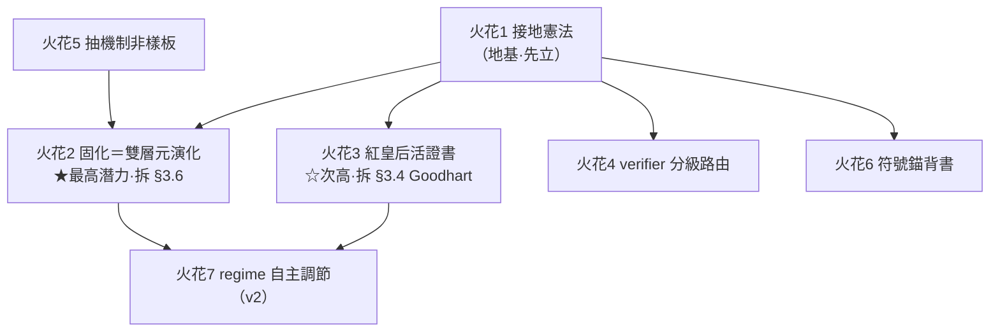

## 火花 6：符號錨把連續漂移離散化 → 受約束生成 / 行數助手的理論背書

| 欄位 | 內容 |
|---|---|
| **來源技術** | [[2601.05280]] §3.3 開的藥方——**符號錨**：程式**不能微量漂移**，要改就得跳到「下一個有效程式」，形成**位能障壁**，把 Thm 4 的連續隨機漫步**離散化**、擋住漂移；收縮力層級「統計更新 < 符號投影 < 因果更新」。 |
| **ai_core 問題** | roadmap §5 下層「受約束生成」+ 行數助手——**為什麼要把笨模型輸出收縮到窄面**（exact string match、插入第 N 行、固定 snippet）？目前理由是「自由度小 → 不易錯」，純經驗直覺，缺底層說法。 |
| **具體做法** | 用符號錨理論**重新表述**這個核心設計（不是新增機制，是給既有決定一個更硬的「為什麼」，從而指導邊界）： • 行數助手 + 固定 snippet + `ast.parse` 守衛 ＝ 把笨模型生成從「**連續自由文字**（會漂移、會 mode collapse）」強制**離散化**到「**有效程式空間的離散跳躍**」。每次生成必須落在「ast 能 parse、簽名符合、錨點存在」的離散有效點，否則 retry——這正是符號錨的**位能障壁**。 • 把 §6.1 ATP 的**三層安全護欄 fail-closed** 解讀成「**符號投影算子**」（把漂移投影回最近的有效程式）。 • 推論一條設計準則：**洞越小、錨越密 → 漂移越被擋死**（呼應火花 4：弱 verifier 環節就該把洞收小、錨加密）。 |
| **效益 / 風險** | 效益：給 ai_core **最核心的設計選擇**（受約束生成）一個動力系統 / 資訊論層級的背書，從「工程直覺」升級成「有理論的必然」；也解釋了為什麼 Claude Code 的 Edit 要 exact-match（roadmap §5 已有此佐證，本火花補上理論）。風險：純理論映射，**別過度宣稱**——ai_core 不是真在跑 KL 更新，只是借其結構直覺；文件須註明這是「類比指導」而非「形式等價」。 |
| **roadmap 落點** | §5 下層受約束生成、§6.1 ATP skeletonize / 三層護欄。 |

---

## 火花 7：自參照可演化性 + node-specific 突變率 → 兩 regime 的自主調節

| 欄位 | 內容 |
|---|---|
| **來源技術** | [[2512.16406]] 自參照 GHN：**突變率＝可被選擇的可遺傳特質**（node-specific，取 M 個 sigmoid 的 max），**全自主升降無外部排程**——環境切換 → 升變異探索、找到高適應度 niche → 降變異集中；「固定隨機基底當輸出層」化解自參照循環悖論。反直覺：在**非靜止任務**上恢復能力完勝 CMA-ES / OpenES / GESMR / SAMR。 |
| **ai_core 問題** | roadmap §3.5 兩 regime（**開機期寬鬆**讓 LLM 多做 / **成熟期嚴格**拒絕為預設）——**誰決定何時、哪個環節從寬鬆轉嚴格？** 目前是人手動盯，且全系統一刀切，不符「不同環節成熟度不同」的現實。 |
| **具體做法** | 把「**某環節的 LLM 留白佔比**」類比成突變率，做成**自主調節的 node-specific 特質**： • 當某環節的確定性 matcher **老是失效**（新意圖湧現、框架變動、trace 顯示掉洞率上升）→ 自動**「升變異」**：放寬該環節讓 LLM 多做（退回開機期姿態）。 • 當某環節**穩定命中、證書穩定度高**（火花 3 的活證書提供訊號）→ 自動**「降變異」**：收緊、把洞固化掉（進入成熟期姿態，觸發火花 2 的固化）。 • **node-specific**：每個 LLM 留白各自處在不同 regime，不一刀切——正對應 2512.16406 的 per-node 突變率。 • 永遠留一點小噪聲（即使收緊也保留「重新打開」的可能）——對應論文「突變率全 0 仍有微變異」，防止某環節被永久焊死、其實世界已變。 |
| **效益 / 風險** | 效益：roadmap §3.5「飛輪＝從寬鬆遷往嚴格的力」變成**自驅動**而非人盯；且 2512.16406 在非靜止任務上的恢復力，正對應「框架會變、意圖會變」的真實 ai_core 環境。風險：論文自承**計算昂貴**、且可能**早熟收斂**（過早收緊一個其實還在變的環節）——須靠「永遠留小噪聲」+ 火花 3 的對抗去偏來抵抗，且這是 v2 級的精緻化，**v0/v1 先人工切 regime 即可**。 |
| **roadmap 落點** | §3.5 兩 regime、§3.6 固化觸發、§8 A/B 兩層開發節奏。 |

---

## 8. 收束：潛力排序與下一步

**潛力排序**

| 名次 | 火花 | 為何 | roadmap 成熟度 |
|---|---|---|---|
| ★ **最有潛力** | **火花 2（固化＝EVOM 雙層元演化 + LLM 島嶼演化）** | 直接拆 roadmap §3.6 那個被自己標為「**此題優先**」的最硬未決問題，且 EVOM 的成本結構（貴外層稀疏 / 廉內層高頻）**天生長在 ai_core 的工廠/消費者分層上**，幾乎是量身定做。 | v1 路線（v0 後） |
| ☆ 次高 | 火花 3（紅皇后活證書） | 把 §3.4「證書會被 Goodhart」的隱憂，變成有對抗去偏 + 選擇性抹除的**可落地活機制**；兩個反直覺收益（便宜評估者省 token、對抗去偏）正中省錢初心。 | v1 |
| 地基 | 火花 1（接地憲法） | 不是錦上添花，是**前提**——沒有它，火花 2/3 的飛輪理論上會崩。應**最先寫進 §3.4**，其餘火花都引用它的 `grounding_class`。 | 立刻可入規範 |
| 可即用 | 火花 4（verifier 分級路由）、火花 6（符號錨背書） | 都不需新機制，是把既有設計（§2 成本梯度、§5 受約束生成）**接上理論並精緻化門檻**，v0 就能採納其準則。 | v0 可採準則 |
| 中期 | 火花 5（抽機制非樣板） | 改的是 §5 資產 schema 的**哲學**，影響深遠但需更強聰明模型驗證，配合 Gap C 一起定。 | v0/v1 schema 設計 |
| 遠期 | 火花 7（regime 自主調節） | 最優雅但最貴、有早熟風險；v0/v1 人工切 regime 即可，留作 v2。 | v2 |

**一句話總結**：這批論文給 ai_core 補的不是新功能，而是**飛輪的三根承重柱**——火花 1 證明「為什麼非確定性接地不可」（地基）、火花 2 給出「固化引擎怎麼自動跑」（引擎）、火花 3 給出「證書怎麼不腐化」（剎車）。三者合起來，正好把 roadmap §3.5–3.6 那段「飛輪 = 從寬鬆遷往嚴格的力」從願景變成可開工的機制。

> 接續：若要開工，先把**火花 1 的 `grounding_class` 欄位**寫進 `workflows/spec/axis_spec.md` 的 nondeterministic 軸 / ATP certificate；再用**火花 2** 草擬 v1 的固化引擎切片（離線批次、島嶼、−1000 守衛、trace 回放當保留集）。
